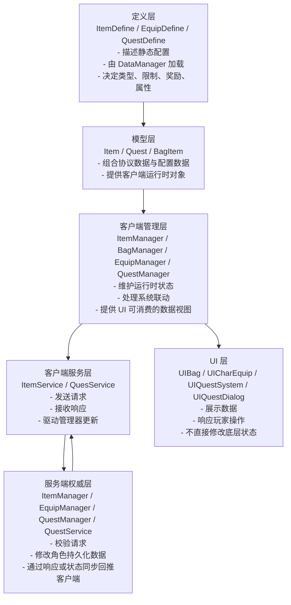

# 核心架构系统分析

## 目录
1. [基础系统整体分层](#1-基础系统整体分层)
2. [客户端运行链路](#2-客户端运行链路)
3. [服务端支撑链路](#3-服务端支撑链路)
4. [系统之间的协作关系](#4-系统之间的协作关系)
5. [当前实现的边界与风险](#5-当前实现的边界与风险)
6. [总结](#6-总结)

---

## 1. 基础系统整体分层

### 1.1 六层结构概览

从当前项目代码看，背包、道具、装备、任务这几套基础系统更适合按“数据定义 + 客户端运行时 + 网络同步 + UI 表现 + 服务端权威状态”去理解。



### 1.2 为什么要这样拆层

这套拆分不是形式上的分层，而是为了解决四类不同问题：

- **Define 层**解决“系统配置是什么”。
- **Model 层**解决“客户端运行时拿什么对象工作”。
- **Manager 层**解决“状态怎么组织、怎么联动”。
- **Service 层**解决“怎么和服务端通信”。
- **UI 层**解决“怎么展示和交互”。
- **服务端层**解决“最终什么状态才算生效”。

### 1.3 四个子系统在这套分层里的位置

- **道具系统**：以 `ItemManager` 为资产中心。
- **背包系统**：以 `BagManager` 为布局视图中心。
- **装备系统**：以 `EquipManager` 为装备槽视图中心。
- **任务系统**：以 `QuestManager` 为任务集合与 NPC 状态中心。

也就是说，基础系统并不是一套单独模块，而是多个模块围绕玩家资产与进度共同协作。

---

## 2. 客户端运行链路

### 2.1 配置到运行时对象的转换

基础系统的第一步是把配置表转成客户端可直接使用的数据。

#### 2.1.1 配置定义层

**文件**：
- `Src/Lib/Common/Data/ItemDefine.cs`
- `Src/Lib/Common/Data/EquipDefine.cs`
- `Src/Lib/Common/Data/QuestDefine.cs`

这些类型描述了：

- 物品基础信息、堆叠上限、使用功能
- 装备槽位与属性加成
- 任务前置、目标、奖励、接提交流程

#### 2.1.2 运行时模型层

**文件**：
- `Src/Client/Assets/Scripts/Models/Item.cs`
- `Src/Client/Assets/Scripts/Models/Quest.cs`
- `Src/Client/Assets/Scripts/Models/BagItem.cs`

其中：

- `Item` 用协议里的 `Id / Count` 结合 `ItemDefine / EquipDefine` 构造可直接消费的对象。
- `Quest` 用 `NQuestInfo` 结合 `QuestDefine` 构造任务对象。
- `BagItem` 是紧凑结构体，用于背包格子的二进制存储与解析。

### 2.2 管理器如何组织状态

客户端真正的状态中心不在 UI，而在各个 Manager：

- `ItemManager`：维护“玩家拥有哪些道具”。
- `BagManager`：维护“这些道具在背包格子里如何摆放”。
- `EquipManager`：维护“哪些道具当前处于装备槽”。
- `QuestManager`：维护“玩家当前任务集合及 NPC 任务状态”。

这里最关键的一点是：

> **Manager 既是状态缓存，也是模块之间的协作中枢。**

### 2.3 UI 的位置

从 UI 代码看，界面本身尽量不直接持有业务规则。

例如：

- `UIBag` 只是遍历 `BagManager.Instance.Items` 来生成格子表现。
- `UICharEquip` 通过 `EquipManager.OnEquipChanged` 刷新身上装备与属性。
- `UIQuestSystem` 通过 `QuestManager.Instance.allQuests` 生成任务列表。

这意味着 UI 主要承担两个职责：

1. 把管理器里的状态显示出来。
2. 把玩家操作转成对 Manager / Service 的调用。

---

## 3. 服务端支撑链路

### 3.1 道具与装备的权威状态

服务端也有对应的 `ItemManager` 与 `EquipManager`：

- 服务端 `ItemManager` 维护角色拥有的真实道具数量。
- 服务端 `EquipManager` 修改角色装备栏对应的二进制槽位数据。

其中服务端 `ItemManager` 还会通过 `StatusManager.AddItemChange` 推送增减变化，这也是客户端 `ItemManager` 能被动同步的基础。

### 3.2 任务的权威处理

任务系统由服务端 `QuestService + QuestManager` 完成：

- `QuestService` 负责接收 `QuestAcceptRequest / QuestSubmitRequest`
- `QuestManager` 负责校验任务是否存在、更新任务状态、发放奖励

客户端只负责发请求和刷新显示，真正的任务是否接受、是否提交成功，都以后端结果为准。

### 3.3 服务端存在的一个明显特征

从当前代码看，基础系统不是靠一套统一总线驱动，而是：

- 道具变化更多依赖状态同步
- 装备变化依赖专门响应 `ItemEquipResponse`
- 任务变化依赖专门响应 `QuestAcceptResponse / QuestSubmitResponse`

所以这套系统是“多种同步方式并存”的实现，而不是单一模式。

---

## 4. 系统之间的协作关系

### 4.1 背包与道具的关系

`ItemManager` 和 `BagManager` 不是重复存储，而是两种不同维度的数据：

- `ItemManager` 关心“物品资产”。
- `BagManager` 关心“背包布局”。

可以理解为：

```text
ItemManager = 玩家拥有什么
BagManager  = 这些东西显示在哪些格子里
```

### 4.2 装备与道具的关系

`EquipManager` 并不复制一份装备对象，而是直接引用 `ItemManager.Instance.Items[itemId]`。

这说明装备系统采用的是：

> **引用共享，而不是数据复制。**

这样设计的好处是：

- 装备和背包看到的是同一个 `Item`
- 以后若扩展耐久、强化等级等字段，不需要同步两份状态
- 脱装备时只清理装备槽引用即可

### 4.3 任务与 NPC 的关系

任务系统的特殊点在于：它不仅维护任务，还要维护 NPC 视角下的任务状态。

`QuestManager.npcQuests` 本质上是在回答一个问题：

> 某个 NPC 当前应该显示“可接”、“进行中”还是“可提交”？

所以任务系统除了任务列表本身，还额外维护了一层按 NPC 分组的索引。

---

## 5. 当前实现的边界与风险

### 5.1 背包删除逻辑未完成

客户端 `BagManager.RemoveItem()` 目前是空实现，这意味着：

- 道具减少时，`ItemManager` 数据会变
- 但背包格子表现不一定能正确同步清理

这属于典型的“资产数据与布局数据不同步”风险。

### 5.2 装备流程描述与代码实现存在偏差

当前服务端穿装备并没有把物品从 `ItemManager` 移除，更多是把装备槽记录为 itemId。

所以正确理解应该是：

- **物品仍然属于角色资产**
- **装备栏只是记录该资产当前挂在某个槽位上**

这点很适合在文档里单独强调，否则容易误解成“装备后背包一定删掉一份”。

### 5.3 任务状态重建成本偏高

客户端任务状态刷新时会清空 `npcQuests` 再重新构建，这种方式逻辑直观，但在任务量变大后，增量更新效率不高。

### 5.4 任务 UI 刷新联动不够集中

从当前代码看，任务 UI 自己初始化列表，但并没有看到特别强的事件驱动刷新机制。随着任务系统变复杂，建议后续统一事件入口。

---

## 6. 总结

基础系统整体可以概括成一句话：

> **配置定义提供静态规则，客户端 Manager 维护运行时状态，Service 负责通信，UI 负责展示，而服务端始终掌握权威结果。**

如果要在面试或项目复盘里快速描述，可以直接说：

- 道具系统以 `ItemManager` 为资产中心
- 背包系统以 `BagManager` 为布局中心
- 装备系统以 `EquipManager` 为槽位视图中心
- 任务系统以 `QuestManager` 为任务与 NPC 状态中心
- 所有结果最终以后端返回或状态同步为准
