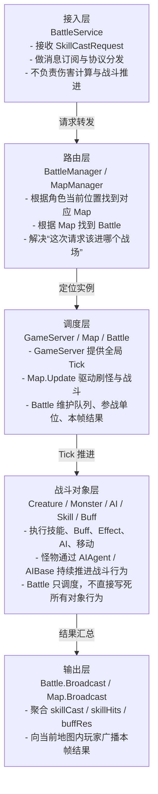
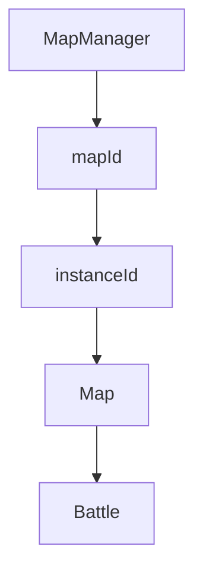

# 核心架构系统分析

## 目录
1. [核心架构设计](#1-核心架构设计)
2. [Tick 驱动与战场调度](#2-tick-驱动与战场调度)
3. [消息流转与广播机制](#3-消息流转与广播机制)
4. [当前实现的边界与风险](#4-当前实现的边界与风险)
5. [代码文件结构](#5-代码文件结构)
6. [总结](#6-总结)

---

## 1. 核心架构设计

### 1.1 五层架构概览

从现有服务端代码看，战斗系统更适合按**运行链路**来理解，而不是按传统 UI/业务/数据三层来理解。



### 1.2 核心对象关系

这套结构里最核心的关系是：



也就是说：

- `MapManager` 管理所有地图实例
- `Map` 是地图实例上下文
- `Battle` 是挂在 `Map` 下面的战斗子系统
- 一个 `Map` 对应一个 `Battle`

这点很关键，因为它决定了：

- 战斗不是全局唯一实例
- 战斗状态天然按地图实例隔离
- 广播范围也是地图实例级别，而不是全服级别

### 1.3 各层职责详解

#### 1.3.1 接入层 (BattleService)

**文件**: `Src/Server/GameServer/GameServer/Services/BattleService.cs`

```csharp
class BattleService : Singleton<BattleService>
{
    public BattleService()
    {
        MessageDistributer<NetConnection<NetSession>>.Instance.Subscribe<SkillCastRequest>(this.OnSkillCast);
    }

    private void OnSkillCast(NetConnection<NetSession> sender, SkillCastRequest request)
    {
        BattleManager.Instance.ProcessBattleMessage(sender, request);
    }
}
```

**职责**:
- 接收客户端发来的 `SkillCastRequest`
- 作为战斗系统的网络入口
- 将请求转发给 `BattleManager`

**不负责**:
- 不负责路由到具体地图实例
- 不负责技能结算
- 不负责 Buff / Effect 更新
- 不负责广播战斗结果

#### 1.3.2 路由层 (BattleManager / MapManager)

**文件**:
- `Src/Server/GameServer/GameServer/Managers/BattleManager.cs`
- `Src/Server/GameServer/GameServer/Managers/MapManager.cs`

```csharp
class BattleManager : Singleton<BattleManager>
{
    public void ProcessBattleMessage(NetConnection<NetSession> sender, SkillCastRequest request)
    {
        Character character = sender.Session.Character;
        var battle = MapManager.Instance[character.Info.mapId].Battle;
        battle.ProcessBattleMessage(sender, request);
    }
}
```

```csharp
class MapManager : Singleton<MapManager>
{
    Dictionary<int, Dictionary<int, Map>> Maps = new Dictionary<int, Dictionary<int, Map>>();
}
```

**职责**:
- 根据角色当前 `mapId` 定位地图
- 从地图实例中取出对应 `Battle`
- 把请求送到正确的战场

**核心价值**:
- `BattleService` 只负责收包
- `BattleManager` 才负责把请求送到哪一个 `Battle`

换句话说，这一层解决的是：

> “这次施法该进哪个战场？”

而不是：

> “这次施法怎么计算？”

#### 1.3.3 调度层 (GameServer / Map / Battle)

**文件**:
- `Src/Server/GameServer/GameServer/GameServer.cs`
- `Src/Server/GameServer/GameServer/Models/Map.cs`
- `Src/Server/GameServer/GameServer/Battle/Battle.cs`

```csharp
while (running)
{
    Time.Tick();
    Thread.Sleep(100);
    mapManager.Update();
    arenaManager.Update();
}
```

```csharp
internal void Update()
{
    SpawnManager.Update();
    this.Battle.Update();
}
```

```csharp
public void Update()
{
    if (this.CastActions.Count > 0)
    {
        NSkillCastInfo skillCast = this.CastActions.Dequeue();
        this.ExecuteAction(skillCast);
    }

    this.UpdateUnits();
    this.BroadcastHitsMessage();
    this.Hits.Clear();
    this.CastSkills.Clear();
    this.BuffsActions.Clear();
}
```

**职责**:
- 提供全局 Tick
- 驱动地图实例逐帧更新
- 维护施法队列 `CastActions`
- 维护参战单位集合 `AllUnits`
- 收集本帧的施法、命中、Buff 结果

其中：

- `GameServer` 提供时间驱动
- `Map` 提供地图上下文
- `Battle` 提供战斗运行时状态

这层是整套战斗系统的“主循环”。

#### 1.3.4 战斗对象层 (Creature / Monster / AI)

**文件**:
- `Src/Server/GameServer/GameServer/Entities/Creature.cs`
- `Src/Server/GameServer/GameServer/Entities/Monster.cs`
- `Src/Server/GameServer/GameServer/AI/AIAgent.cs`
- `Src/Server/GameServer/GameServer/AI/AIBase.cs`

```csharp
public override void Update()
{
    this.SkillMgr.Update();
    this.BuffMgr.Upate();
    this.EffectMgr.Upate();
}
```

```csharp
public override void Update()
{
    base.Update();
    this.UpdateMovement();
    this.AI.Update();
}
```

**职责**:
- `Creature` 负责技能、Buff、Effect、属性、施法入口
- `Monster` 在 `Creature` 基础上增加移动和 AI
- `AIAgent / AIBase` 负责怪物目标选择、技能释放、追击逻辑

**关键点**:
- `Battle` 不负责每种对象的细节行为
- `Battle` 只负责遍历参战单位并调用 `Update()`
- 真正的战斗行为落在 `Creature / Monster / AI` 上

#### 1.3.5 输出层 (Battle / Map)

**文件**:
- `Src/Server/GameServer/GameServer/Battle/Battle.cs`
- `Src/Server/GameServer/GameServer/Models/Map.cs`

```csharp
private void BroadcastHitsMessage()
{
    if (this.Hits.Count == 0 && this.BuffsActions.Count == 0 && this.CastSkills.Count == 0)
        return;

    NetMessageResponse message = new NetMessageResponse();
    // 组装 skillHits / buffRes / skillCast
    this.Map.BroadcastBattleResponse(message);
}
```

```csharp
public void BroadcastBattleResponse(NetMessageResponse response)
{
    foreach (var kv in this.MapCharacters)
    {
        kv.Value.connection.SendResponse();
    }
}
```

**职责**:
- `Battle` 负责汇总“这一帧要发什么”
- `Map` 负责决定“发给谁”

这意味着广播范围天然跟地图实例绑定，而不是跟战斗请求来源绑定。

---

## 2. Tick 驱动与战场调度

### 2.1 全局 Tick 来源

整个服务端战斗系统的时间源来自 `GameServer.Update()`：

```csharp
while (running)
{
    Time.Tick();
    Thread.Sleep(100);   // 约 10Hz
    mapManager.Update();
    arenaManager.Update();
}
```

这表示当前战斗推进节奏大致是：

- 每 `100ms` 一个逻辑 Tick
- 每个 Tick 统一推进所有地图实例

### 2.2 完整调度链路

```text
GameServer.Update
    ↓
MapManager.Update
    ↓
Map.Update
    ├─ SpawnManager.Update
    └─ Battle.Update
           ↓
        UpdateUnits
           ↓
        Creature.Update / Monster.Update
```

### 2.3 Battle 的运行时数据

`Battle` 本质上是“某个地图实例下的战斗运行时容器”。

| 数据 | 作用 |
|------|------|
| `AllUnits` | 当前加入战斗更新链路的单位 |
| `CastActions` | 等待执行的施法动作队列 |
| `CastSkills` | 本帧施法结果列表 |
| `Hits` | 本帧伤害结果列表 |
| `BuffsActions` | 本帧 Buff 操作结果列表 |

### 2.4 Map 与 Battle 的边界

这是这份文档里最应该讲清楚的一点：

| 对象 | 负责什么 |
|------|----------|
| `Map` | 地图上下文、地图玩家、刷怪、怪物管理、广播范围 |
| `Battle` | 战斗队列、参战单位、战斗 Tick、结果聚合 |

所以更准确的理解是：

> `Map` 是“地图实例容器”，`Battle` 是“挂在这个容器上的战斗子系统”。

### 2.5 怪物 AI 为什么也属于战斗系统

因为怪物不是收到网络消息才行动，而是在 `Battle.Update -> UpdateUnits -> Monster.Update -> AI.Update` 这条链上持续推进。

完整链路如下：

```text
Battle.Update
  -> UpdateUnits
      -> Creature.Update
      -> Monster.Update
          -> UpdateMovement
          -> AIAgent.Update
              -> AIBase.UpdateBattle
```

这说明战斗系统不只是“收到技能请求然后算一下伤害”，而是一个持续运行的服务器战斗模拟循环。

---

## 3. 消息流转与广播机制

### 3.1 玩家施法请求流转

```text
Client
  -> SkillCastRequest
  -> BattleService.OnSkillCast
  -> BattleManager.ProcessBattleMessage
  -> MapManager 定位 Map
  -> Map.Battle.ProcessBattleMessage
  -> CastActions.Enqueue
```

这一阶段只做两件事：

1. 接收请求
2. 把请求放入战斗队列

还没有真正执行技能。

### 3.2 技能真正执行的时机

技能不是在收到请求的瞬间立刻执行，而是在下一次 `Battle.Update()` 时被消费：

```csharp
if (this.CastActions.Count > 0)
{
    NSkillCastInfo skillCast = this.CastActions.Dequeue();
    this.ExecuteAction(skillCast);
}
```

随后执行链路大致是：

```text
CastActions.Dequeue
    ↓
ExecuteAction
    ↓
Creature.CastSkill
    ↓
Skill / Buff / Hit 写入 Battle 本帧结果
```

### 3.3 本帧结果广播

战斗结果不是边执行边发，而是统一在帧末处理：

```text
ExecuteAction / UpdateUnits
    ↓
Battle 收集 CastSkills / Hits / BuffsActions
    ↓
Battle.BroadcastHitsMessage
    ↓
Map.BroadcastBattleResponse
    ↓
广播给当前地图中的所有玩家
```

### 3.4 这种设计的好处

| 设计点 | 作用 |
|------|------|
| 请求先入队 | 避免请求到达即改状态，时序更稳定 |
| Tick 统一推进 | 战斗逻辑有固定节奏，便于维护 |
| 帧末聚合广播 | 减少网络包碎片，输出更集中 |
| 地图级广播 | 广播范围清晰，不容易跨地图污染 |

---

## 4. 当前实现的边界与风险

### 4.1 多实例地图的路由风险

当前 `BattleManager` 是这样取战场实例的：

```csharp
var battle = MapManager.Instance[character.Info.mapId].Battle;
```

而 `MapManager` 的索引器默认返回：

```csharp
this.Maps[key][0]
```

这表示：

- 普通地图单实例没有问题
- 竞技场这种多实例场景可能默认取到实例 `0`

所以当前路由层已经有“按地图找战场”的结构，但“按实例精确路由”还不完整。

### 4.2 吞吐上限风险

当前 `Battle.Update()` 每 Tick 只消费一个施法动作：

```csharp
NSkillCastInfo skillCast = this.CastActions.Dequeue();
```

结合 `100ms` Tick，这意味着：

- 高并发群战时，`CastActions` 可能积压
- 客户端看到的表现延迟可能被放大

### 4.3 AllUnits 与地图实体池不是一回事

`AllUnits` 存的是：

- 当前进入战斗更新链路的单位

而地图实体池代表的是：

- 当前地图实例里存在的实体

例如：

```csharp
EntityManager.Instance.GetMapEntitiesInRange<Creature>(...)
```

查到的是地图里的单位，但这些单位不一定已经进入 `AllUnits`。

所以要避免混淆下面两个概念：

- 在地图里存在
- 在战斗系统里持续更新

---

## 5. 代码文件结构

### 5.1 核心文件清单

| 文件 | 路径 | 说明 |
|------|------|------|
| **BattleService.cs** | `Src/Server/GameServer/GameServer/Services/BattleService.cs` | 战斗请求入口，订阅网络消息 |
| **BattleManager.cs** | `Src/Server/GameServer/GameServer/Managers/BattleManager.cs` | 将请求路由到对应 `Battle` |
| **MapManager.cs** | `Src/Server/GameServer/GameServer/Managers/MapManager.cs` | 管理所有地图实例 |
| **Map.cs** | `Src/Server/GameServer/GameServer/Models/Map.cs` | 地图实例上下文，负责地图广播 |
| **Battle.cs** | `Src/Server/GameServer/GameServer/Battle/Battle.cs` | 战场运行时、队列、结果聚合 |
| **Creature.cs** | `Src/Server/GameServer/GameServer/Entities/Creature.cs` | 通用战斗单位基类 |
| **Monster.cs** | `Src/Server/GameServer/GameServer/Entities/Monster.cs` | 怪物单位，增加移动与 AI |
| **AIAgent.cs** | `Src/Server/GameServer/GameServer/AI/AIAgent.cs` | AI 调度入口 |
| **AIBase.cs** | `Src/Server/GameServer/GameServer/AI/AIBase.cs` | AI 行为主逻辑 |
| **GameServer.cs** | `Src/Server/GameServer/GameServer/GameServer.cs` | 全局逻辑 Tick 源头 |

### 5.2 调用关系速查

| 场景 | 入口 | 中间层 | 最终落点 |
|------|------|--------|----------|
| 玩家施法 | `BattleService` | `BattleManager -> MapManager` | `Map.Battle.ProcessBattleMessage` |
| 战斗推进 | `GameServer.Update` | `MapManager.Update -> Map.Update` | `Battle.Update` |
| 怪物 AI | `Battle.Update` | `UpdateUnits -> Monster.Update` | `AIAgent / AIBase` |
| 战斗广播 | `Battle.BroadcastHitsMessage` | `Map.BroadcastBattleResponse` | 当前地图玩家连接 |

---

## 6. 总结

### 6.1 这套架构最重要的四句话

1. **`BattleService` 是入口，不做结算**
2. **`BattleManager / MapManager` 负责把请求送到正确实例**
3. **`Battle` 是战斗调度器，不是所有战斗逻辑的承载者**
4. **`Creature / Monster / AI` 才是真正执行技能、Buff、移动和追击的地方**

### 6.2 一句话理解整个系统

这套战斗系统本质上是：

> **“入口收包 -> 路由定位 -> Tick 调度 -> 对象执行 -> 帧末广播” 的服务端战斗模拟系统。**

### 6.3 适合放在文档开头的摘要

> 服务端战斗系统按职责可以分为五层：接入层 `BattleService`、路由层 `BattleManager + MapManager`、调度层 `GameServer + Map + Battle`、战斗对象层 `Creature + Monster + AI`、输出层 `Battle + Map`。其中 `Map` 提供地图实例上下文，`Battle` 提供战斗运行时状态，二者是一对一绑定关系。
