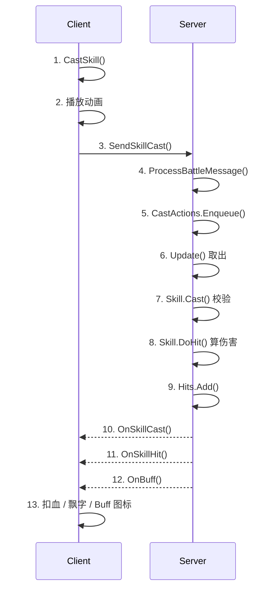
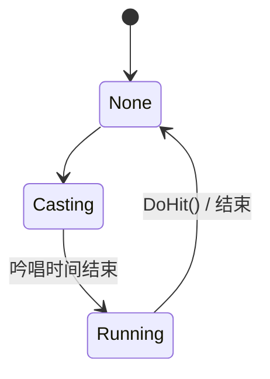

# 技能释放流程系统分析

## 1. 概述

技能释放采用 **客户端预测 + 服务端校验** 的架构，确保流畅的用户体验同时防止作弊。

### 1.1 职责边界

- **客户端**：输入采集、目标选择、本地动画/特效预播放、回包后表现校正。
- **服务端**：施法合法性校验、技能状态推进、伤害与 Buff 结算、结果广播。
- **协议层**：通过 `SkillCastRequest / SkillCastResponse / SkillHitResponse / BuffResponse` 串联主流程。

## 2. 流程时序图



## 3. 客户端流程

### 3.1 发起技能施放

**BattleManager.CastSkill** (`Src/Client/Assets/Scripts/Managers/BattleMananger.cs`):
```csharp
public void CastSkill(Skill skill)
{
    // 安全检查：如果不是当前玩家，直接返回
    if (!skill.Owner.IsCurrentPlayer) return;

    // 本地预校验
    if (skill.CanCast(currentTarget) != SkillResult.Ok)
    {
        return;
    }

    int target = currentTarget != null ? currentTarget.entityId : 0;
    
    // 发送请求到服务端
    BattleService.Instance.SendSkillCast(skill.Define.ID, skill.Owner.entityId, target, currentPosition);
    
    // 客户端立即播放动画（预测）
    if (skill.Owner.IsCurrentPlayer)
    {
        skill.Owner.CastSkill(skill.Define.ID, currentTarget, currentPosition);
    }
}
```

### 3.2 技能预校验

**Skill.CanCast** (`Src/Client/Assets/Scripts/Battle/Skill.cs`):
```csharp
public SkillResult CanCast(Creature target)
{
    // 检查是否正在施法
    if (this.Owner.CastingSkill != null)
    {
        return SkillResult.Casting;
    }

    // 目标类型检查
    if (this.Define.CastTarget == TargetType.Target)
    {
        if (target == null || target == this.Owner)
            return SkillResult.InvalidTarget;
        
        int distance = this.Owner.Distance(target);
        if (distance > this.Define.CastRange)
            return SkillResult.OutOfRange;
    }

    // 位置目标检查
    if (this.Define.CastTarget == TargetType.Position && BattleMananger.Instance.CreaturePosition == null)
    {
        return SkillResult.InvalidTarget;
    }

    // MP检查
    if (this.Owner.Attributes.MP < this.Define.MPCost)
    {
        return SkillResult.OutOfMp;
    }

    // CD检查
    if (this.cd > 0)
    {
        return SkillResult.CoolDown;
    }

    return SkillResult.Ok;
}
```

### 3.3 开始施法

**Skill.BeginCast** (`Src/Client/Assets/Scripts/Battle/Skill.cs`):
```csharp
public void BeginCast(Creature target, NVector3 pos)
{
    this.IsCasting = true;
    this.castTime = 0;
    this.cd = this.Define.CD;
    this.Target = target;
    this.skillTime = 0;
    this.Hit = 0;
    this.TargetPosition = pos;
    this.Bullets.Clear();
    this.HitMap.Clear();
    
    // 重置并设置待机状态，强制触发状态过渡
    this.Owner.SetStandby(false);
    this.Owner.SetStandby(true);
    
    // 面向目标
    if (this.Define.CastTarget == TargetType.Position)
    {
        this.Owner.FaceTo(this.TargetPosition.ToVector3Int());
    }
    else if (this.Define.CastTarget == TargetType.Target)
    {
        this.Owner.FaceTo(this.Target.position);
    }
    
    this.Owner.CastingSkill = this;
    
    // 播放技能动画
    this.Owner.PlayAnim(this.Define.SkillAnim);
    
    // 判断是否需要吟唱时间
    if (this.Define.CastTime > 0)
    {
        this.Status = SkillStatus.Casting;
    }
    else
    {
        this.StartSkill();
    }
}
```

### 3.4 防抖动处理

**BattleService.OnSkillCast** (`Src/Client/Assets/Scripts/Services/BattleService.cs`):
```csharp
private void OnSkillCast(object sender, SkillCastResponse message)
{
    foreach (var cast in castInfoes)
    {
        Creature caster = EntityManager.Instance.GetEntity(cast.casterId) as Creature;
        if (caster != null)
        {
            // 关键：如果是当前玩家，跳过服务器的播放指令，避免动画重置
            if (caster.IsCurrentPlayer)
            {
                continue;
            }
            Creature target = EntityManager.Instance.GetEntity(cast.targetId) as Creature;
            caster.CastSkill(cast.skillId, target, cast.Position);
        }
    }
}
```

### 3.5 处理伤害响应

**BattleService.OnSkillHit** (`Src/Client/Assets/Scripts/Services/BattleService.cs`):
```csharp
private void OnSkillHit(object sender, SkillHitResponse message)
{
    if (message.Resul == Result.Success)
    {
        BattleMananger.Instance.ProcessBattleMessage(message);
    }
}
```

**BattleManager.ProcessBattleMessage** (`Src/Client/Assets/Scripts/Managers/BattleMananger.cs`):
```csharp
internal void ProcessBattleMessage(SkillHitResponse message)
{
    foreach (var Hit in message.Hits)
    {
        var caster = EntityManager.Instance.GetEntity(Hit.casterId) as Creature;
        if (caster != null)
        {
            caster.DoSkillHit(Hit);
        }
    }
}
```

## 4. 服务端流程

### 4.1 接收施法请求

**Battle.ProcessBattleMessage** (`Src/Server/GameServer/GameServer/Battle/Battle.cs`):
```csharp
public void ProcessBattleMessage(NetConnection<NetSession> sender, SkillCastRequest request)
{
    Character character = sender.Session.Character;
    if (request.castInfo != null)
    {
        // 验证施法者身份
        if (character.entityId != request.castInfo.casterId)
        {
            return;
        }
        // 入队等待处理
        this.CastActions.Enqueue(request.castInfo);
    }
}
```

### 4.2 执行施法动作

**Battle.ExecuteAction** (`Src/Server/GameServer/GameServer/Battle/Battle.cs`):
```csharp
private void ExecuteAction(NSkillCastInfo cast)
{
    // 创建战斗上下文
    BattleContext context = new BattleContext(this);
    context.Caster = EntityManager.Instance.GetCreature(cast.casterId);
    context.Target = EntityManager.Instance.GetCreature(cast.targetId);
    context.Position = cast.Position;
    context.CastSkill = cast;
    
    // 加入战斗
    if (context.Caster != null)
        this.JoinBattle(context.Caster);
    if (context.Target != null)
        this.JoinBattle(context.Target);

    // 执行施法
    context.Caster.CastSkill(context, cast.skillId);
}
```

### 4.3 服务端技能校验与施放

**Skill.Cast** (`Src/Server/GameServer/GameServer/Battle/Skill.cs`):
```csharp
public SkillResult Cast(BattleContext context)
{
    SkillResult result = this.CanCast(context);

    if (result == SkillResult.Ok)
    {
        InitSkill(context);
        
        // 触发施法时Buff
        this.AddBuff(TriggerType.SkillCast, this.Context.Target);

        // 瞬发技能立即命中
        if (this.Instant)
        {
            this.DoHit();
        }
        else
        {
            if (this.Define.CastTime > 0)
                this.Status = SkillStatus.Casting;
            else
                this.Status = SkillStatus.Running;
        }
    }
    return result;
}
```

### 4.4 伤害计算

**Skill.DoHit** (`Src/Server/GameServer/GameServer/Battle/Skill.cs`):
```csharp
public void DoHit(NSkillHitInfo hitInfo)
{
    Context.Battle.AddHitInfo(hitInfo);

    // AOE范围伤害
    if (this.Define.AOERange > 0)
    {
        this.HitRange(hitInfo);
        return;
    }

    // 单体目标伤害
    if (this.Define.CastTarget == TargetType.Target)
    {
        this.HitTarget(Context.Target, hitInfo);
    }
}
```

**Skill.CalcSkillDamage** (`Src/Server/GameServer/GameServer/Battle/Skill.cs`):
```csharp
private NDamageInfo CalcSkillDamage(Creature caster, Creature target)
{
    // 基础伤害计算
    float ad = this.Define.AD + caster.Attributes.AD * this.Define.ADFatcor;
    float ap = this.Define.AP + caster.Attributes.AP * this.Define.APFatcor;

    // 防御减免公式
    float addmg = ad * (1 - target.Attributes.DEF / (target.Attributes.DEF + 100));
    float apdmg = ap * (1 - target.Attributes.MDEF / (target.Attributes.MDEF + 100));

    float final = addmg + apdmg;
    
    // 暴击判定
    bool isCrit = IsCrit(caster.Attributes.CRI);
    if (isCrit)
    {
        final = final * 2f; // 暴击两倍伤害
    }
    
    // 当前代码：乘以 [-5%, +5%] 区间随机值
    final = final * ((float)MathUtil.Random.NextDouble() * 0.1f - 0.05f);

    NDamageInfo damageInfo = new NDamageInfo();
    damageInfo.Damage = Math.Max(1, (int)final);
    damageInfo.entityId = target.entityId;
    damageInfo.Crit = isCrit;
    return damageInfo;
}
```

## 5. 技能状态机



**SkillStatus 枚举**:
- `None`: 空闲状态
- `Casting`: 吟唱中
- `Running`: 技能执行中

## 6. 关键设计要点

1. **客户端预测**：客户端先播动画再发请求，保证操作响应即时性
2. **防抖动**：服务端返回的施法响应对当前玩家跳过，避免动画重置
3. **服务端权威**：所有伤害计算在服务端执行，客户端只负责显示
4. **队列化处理**：施法请求先入队，保证时序一致性
5. **防御公式**：采用 `damage * (1 - def/(def+100))` 的递减公式，避免防御过高无敌

## 7. 实践梳理补充（建议记住）

1. **单连接防伪造**：服务端会验证 `request.castInfo.casterId == sender.Session.Character.entityId`。
2. **吞吐边界**：当前每 Tick 处理 1 次施法动作，请在压测中关注队列积压。
3. **随机系数说明**：当前实现会显著压低伤害值（并由 `Math.Max(1, ...)` 托底），若要实现常见“±5%浮动”，应改为 `final *= (1 + rand)`。
