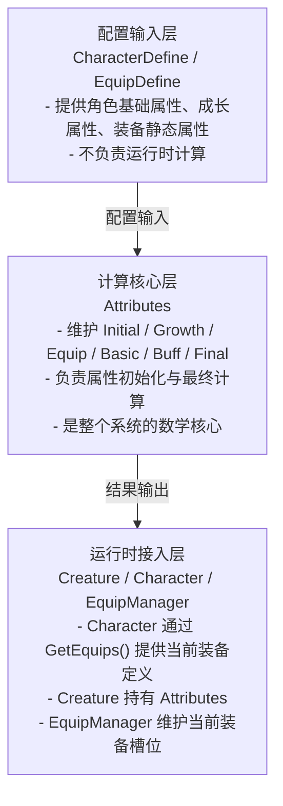
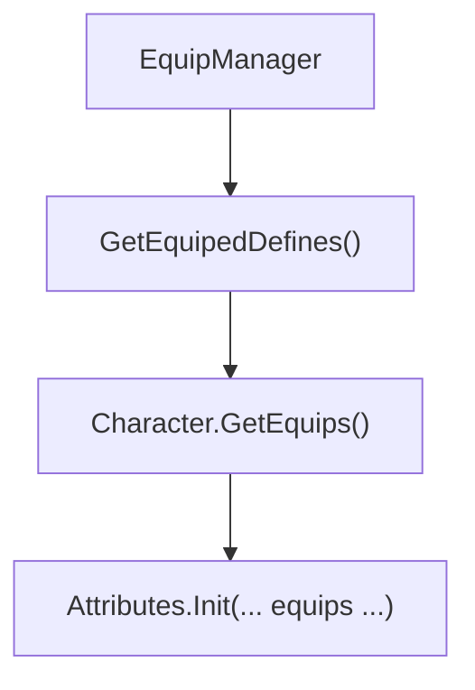

# 属性与装备系统分析

## 目录

1. [核心架构设计](#1-核心架构设计)
2. [属性计算流程](#2-属性计算流程)
3. [装备如何影响属性](#3-装备如何影响属性)
4. [属性与 Buff 及战斗公式的关系](#4-属性与-buff-及战斗公式的关系)
5. [当前实现的边界与注意点](#5-当前实现的边界与注意点)
6. [代码文件结构](#6-代码文件结构)
7. [总结](#7-总结)

---

## 1. 核心架构设计

### 1.1 三部分结构概览

这套“属性与装备系统”如果按职责来看，可以拆成三个部分：



这比直接说“属性系统 + 装备系统”更清晰，因为真正的核心不是 UI，也不是装备槽本身，而是：

> **装备配置如何被注入到 `Attributes`，并参与最终属性计算。**

### 1.2 属性数据分层

`Attributes` 不是一个简单的“属性表”，而是一个**分层计算模型**。

```csharp
public class Attributes
{
    AttributeData Initial = new AttributeData(); // 初始属性
    AttributeData Growth = new AttributeData();  // 成长属性
    AttributeData Equip = new AttributeData();   // 装备属性
    public AttributeData Basic = new AttributeData(); // 基础属性
    public AttributeData Buff = new AttributeData();  // Buff属性
    public AttributeData Final = new AttributeData(); // 最终属性
}
```

这 6 层分别表示：

| 层级        | 含义                  |
| --------- | ------------------- |
| `Initial` | 角色模板自带初始值           |
| `Growth`  | 角色每级成长值             |
| `Equip`   | 当前装备提供的加成           |
| `Basic`   | 初始 + 成长 + 装备之后的基础属性 |
| `Buff`    | 战斗中临时增减的属性          |
| `Final`   | 最终用于战斗计算的属性         |

### 1.3 一句话公式

这套属性模型最核心的一句话是：

```text
Final = Basic + Buff
Basic = Initial + Growth(按等级) + Equip
```

如果展开成更完整的口语版就是：

> **先用角色模板和等级算出基础值，再把装备加上去，最后再叠加 Buff，得到真正参与战斗结算的最终属性。**

### 1.4 各部分职责详解

#### 1.4.1 配置输入层 (CharacterDefine / EquipDefine)

**文件**:

- `Src/Lib/Common/Data/CharacterDefine.cs`
- `Src/Lib/Common/Data/EquipDefine.cs`

**职责**:

- `CharacterDefine` 提供角色初始属性与成长属性
- `EquipDefine` 提供装备静态属性加成
- 两者都只负责“提供配置”，不负责运行时计算

#### 1.4.2 计算核心层 (Attributes)

**文件**: `Src/Lib/Common/Battle/Attributes.cs`

```csharp
public void Init(CharacterDefine define, int level, List<EquipDefine> equips, NAttributeDynamic dynamicAttr)
{
    this.DynamicAttr = dynamicAttr;
    this.LoadInitAttribute(this.Initial, define);
    this.LoadGrowthAttribute(this.Growth, define);
    this.LoadEquipAttribute(this.Equip, equips);
    this.Level = level;
    this.InitBasicAttributes();
    this.InitSecondaryAttributes();
    this.InitFinalAttributes();
}
```

**职责**:

- 读取角色模板、等级、装备定义
- 完成属性初始化
- 对外暴露 `MaxHP / AD / DEF / AP` 等最终值

#### 1.4.3 运行时接入层 (Creature / Character / EquipManager)

**文件**:

- `Src/Client/Assets/Scripts/Entities/Creature.cs`
- `Src/Client/Assets/Scripts/Entities/Character.cs`
- `Src/Client/Assets/Scripts/Managers/EquipManager.cs`

```csharp
public Creature(NCharacterInfo info) : base(info.Entity)
{
    Info = info;
    Define = DataManager.Instance.Characters[info.ConfigId];
    Attributes = new Attributes();
    Attributes.Init(Define, Info.Level, GetEquips(), Info.AttrDynamic);
}
```

```csharp
public override List<EquipDefine> GetEquips()
{
    return EquipManager.Instance.GetEquipedDefines();
}
```

**职责**:

- `Creature` 持有 `Attributes`
- `Character` 负责告诉 `Attributes` “我当前穿了哪些装备”
- `EquipManager` 负责维护当前装备槽中的数据

所以装备系统和属性系统的真正连接点是：

> `Character.GetEquips() -> Attributes.Init(... equips ...)`

***

## 2. 属性计算流程

### 2.1 初始化主流程

属性初始化完整链路如下：

```text
CharacterDefine / Level / EquipDefine 列表
    ↓
Attributes.Init()
    ├─ LoadInitAttribute()
    ├─ LoadGrowthAttribute()
    ├─ LoadEquipAttribute()
    ├─ InitBasicAttributes()
    ├─ InitSecondaryAttributes()
    └─ InitFinalAttributes()
```

### 2.2 初始属性与成长属性

**初始属性**来自角色模板：

```csharp
private void LoadInitAttribute(AttributeData attr, CharacterDefine define)
{
    attr.MaxHP = define.MaxHP;
    attr.MaxMP = define.MaxMP;
    attr.STR = define.STR;
    attr.INT = define.INT;
    attr.DEX = define.DEX;
    attr.AD = define.AD;
    attr.AP = define.AP;
    attr.DEF = define.DEF;
    attr.MDEF = define.MDEF;
    attr.SPD = define.SPD;
    attr.CRI = define.CRI;
}
```

**成长属性**只负责一级属性的等级增长：

```csharp
private void LoadGrowthAttribute(AttributeData attr, CharacterDefine define)
{
    attr.STR = define.GrowthSTR;
    attr.INT = define.GrowthINT;
    attr.DEX = define.GrowthDEX;
}
```

### 2.3 基础属性计算

`InitBasicAttributes()` 负责把初始属性、成长属性和装备一级属性合并进来：

```csharp
public void InitBasicAttributes()
{
    for (int i = (int)AttributeType.MaxHP; i < (int)AttributeType.MAX; i++)
    {
        this.Basic.Data[i] = this.Initial.Data[i];
    }

    for (int i = (int)AttributeType.STR; i < (int)AttributeType.DEX; i++)
    {
        this.Basic.Data[i] = this.Initial.Data[i] + this.Growth.Data[i] * (this.Level - 1);
        this.Basic.Data[i] += this.Equip.Data[i];
    }
}
```

这里最关键的一点是：

- 一级属性会吃到成长
- 装备的一部分加成也会先进入一级属性

### 2.4 二级属性计算

`InitSecondaryAttributes()` 用一级属性和装备二级属性推导二级属性：

```csharp
public void InitSecondaryAttributes()
{
    this.Basic.MaxHP = this.Basic.STR * 10 + this.Initial.MaxHP + this.Equip.MaxHP;
    this.Basic.MaxMP = this.Basic.INT * 10 + this.Initial.MaxMP + this.Equip.MaxMP;
    this.Basic.AD = this.Basic.STR * 5 + this.Initial.AD + this.Equip.AD;
    this.Basic.AP = this.Basic.INT * 5 + this.Initial.AP + this.Equip.AP;
    this.Basic.DEF = this.Basic.STR * 2 + this.Basic.DEX * 1 + this.Initial.DEF + this.Equip.DEF;
    this.Basic.MDEF = this.Basic.INT * 2 + this.Basic.DEX * 1 + this.Initial.MDEF + this.Equip.MDEF;
    this.Basic.SPD = this.Basic.DEX * 0.2f + this.Initial.SPD + this.Equip.SPD;
    this.Basic.CRI = this.Basic.DEX * 0.0002f + this.Initial.CRI + this.Equip.CRI;
}
```

可以理解为：

- 一级属性决定角色成长方向
- 二级属性是战斗真正读取的核心值
- 装备既能直接加二级属性，也能通过一级属性间接放大二级属性

### 2.5 最终属性计算

`InitFinalAttributes()` 只做一件事：

```csharp
public void InitFinalAttributes()
{
    for (int i = (int)AttributeType.MaxHP; i < (int)AttributeType.MAX; i++)
    {
        this.Final.Data[i] = this.Basic.Data[i] + this.Buff.Data[i];
    }
}
```

这意味着：

- 装备影响的是 `Basic`
- Buff 影响的是 `Final`
- 战斗结算读的是最终值 `Final`

### 2.6 关键公式速查

| 属性      | 公式                                    |
| ------- | ------------------------------------- |
| `MaxHP` | `STR × 10 + 初始MaxHP + 装备MaxHP`        |
| `MaxMP` | `INT × 10 + 初始MaxMP + 装备MaxMP`        |
| `AD`    | `STR × 5 + 初始AD + 装备AD`               |
| `AP`    | `INT × 5 + 初始AP + 装备AP`               |
| `DEF`   | `STR × 2 + DEX × 1 + 初始DEF + 装备DEF`   |
| `MDEF`  | `INT × 2 + DEX × 1 + 初始MDEF + 装备MDEF` |
| `SPD`   | `DEX × 0.2 + 初始SPD + 装备SPD`           |
| `CRI`   | `DEX × 0.0002 + 初始CRI + 装备CRI`        |

### 2.7 动态属性与静态属性

除了上面的静态计算层，还有一个运行时动态层：

```csharp
public NAttributeDynamic DynamicAttr;

public float HP
{
    get { return DynamicAttr.Hp; }
    set { DynamicAttr.Hp = (int)Math.Min(MaxHP, value); }
}
public float MP
{
    get { return DynamicAttr.Mp; }
    set { DynamicAttr.Mp = (int)Math.Min(MaxMP, value); }
}
```

也就是说：

- `MaxHP / MaxMP / AD / DEF` 这些是静态计算结果
- `HP / MP` 是运行时动态值

这套设计把“上限值”和“当前值”分开了。

***

## 3. 装备如何影响属性

### 3.1 装备属性的输入点

装备并不是直接改 `Final`，而是先汇总到 `Equip` 层。

```csharp
private void LoadEquipAttribute(AttributeData attr, List<EquipDefine> equips)
{
    attr.Reset();
    if (equips == null)
    {
        return;
    }
    foreach (var define in equips)
    {
        attr.MaxHP += define.MaxHP;
        attr.MaxMP += define.MaxMP;
        attr.STR += define.STR;
        attr.INT += define.INT;
        attr.DEX += define.DEX;
        attr.AD += define.AD;
        attr.AP += define.AP;
        attr.DEF += define.DEF;
        attr.MDEF += define.MDEF;
        attr.SPD += define.SPD;
        attr.CRI += define.CRI;
    }
}
```

所以装备系统对属性系统的真实贡献是：

> **把多个** **`EquipDefine`** **汇总成一份** **`Equip AttributeData`。**

### 3.2 客户端装备数据来源

客户端当前装备由 `EquipManager` 维护：

```csharp
public Item[] Equips = new Item[(int)EquipSlot.SlotMax];

public List<EquipDefine> GetEquipedDefines()
{
    List<EquipDefine> result = new List<EquipDefine>();
    for (int i = 0; i < (int)EquipSlot.SlotMax; i++)
    {
        if (Equips[i] != null)
        {
            result.Add(Equips[i].EquipInfo);
        }
    }
    return result;
}
```

这说明客户端装备系统不直接存一份“属性值”，而是：

- 先维护装备槽位上的 `Item`
- 再由 `Item.EquipInfo` 提供 `EquipDefine`
- 最后交给 `Attributes` 统一计算

### 3.3 客户端穿装备链路

客户端穿装备流程大致如下：

```text
UI 点击穿装备
    ↓
EquipManager.EquipItem(item)
    ↓
ItemService.SendEquipItem()
    ↓
服务器返回 ItemEquipResponse
    ↓
EquipManager.OnEquipItem(item)
    ↓
OnEquipChanged 事件
```

相关代码：

```csharp
public void EquipItem(Item equip)
{
    ItemService.Instance.SendEquipItem(equip, true);
}

public void OnEquipItem(Item equip)
{
    this.Equips[(int)equip.EquipInfo.slot] = ItemManager.Instance.Items[equip.Id];
    if (OnEquipChanged != null)
    {
        OnEquipChanged();
    }
}
```

### 3.4 装备和属性系统的连接点

从文档结构上，最应该讲清楚的不是“装备 UI 怎么点”，而是下面这个连接关系：



这说明：

- `EquipManager` 负责持有当前装备数据
- `Character` 负责把装备数据暴露给属性系统
- `Attributes` 负责统一把装备纳入计算

### 3.5 为什么装备不直接改 Final

因为如果装备直接改 `Final`，会出现两个问题：

1. 装备和 Buff 会混在一起，职责不清
2. 一级属性对二级属性的转换关系就不好维护

现在的分层方式更合理：

- 装备进入 `Equip`
- Buff 进入 `Buff`
- 最后统一合成 `Final`

***

## 4. 属性与 Buff 及战斗公式的关系

### 4.1 Buff 只改 Buff 层

从代码职责看，Buff 系统修改的是：

- `Owner.Attributes.Buff`

然后调用：

```csharp
this.Owner.Attributes.InitFinalAttributes();
```

这说明 Buff 并不重跑整套“初始/成长/装备”逻辑，而是只在最终层叠加。

### 4.2 战斗公式读的是 Final

战斗系统不应该直接读：

- `Initial`
- `Growth`
- `Equip`
- `Basic`

而应该读：

- `Final`

因为 `Final` 才是：

- 已考虑等级成长
- 已考虑装备加成
- 已考虑 Buff 叠加

之后的统一结果。

### 4.3 这套设计的价值

| 设计点                       | 价值                |
| ------------------------- | ----------------- |
| 属性分层                      | 方便区分基础值、装备值、Buff值 |
| 装备统一注入 `Equip`            | 装备不会和 Buff 混在一起   |
| 最终统一落到 `Final`            | 战斗公式读取简单、稳定       |
| `DynamicAttr` 单独存当前 HP/MP | 上限与当前值分离，运行时更清晰   |

***

## 5. 当前实现的边界与注意点

### 5.1 这篇文档的重点其实是“属性计算核心”

虽然文件名叫“属性与装备系统”，但从代码现实看：

- `Attributes` 才是绝对主角
- 装备系统在这里更多是“属性输入源”

所以读这篇时要明确：

> 这篇重点不是装备 UI，也不是装备协议，而是“装备如何进入属性计算”。

### 5.2 装备变化后的重算链路要和真实代码分开看

当前客户端代码里明确能看到的是：

- `EquipManager.OnEquipItem()` 会更新装备槽
- 会触发 `OnEquipChanged`
- 这个事件目前主要被 UI 使用

也就是说，文档如果写“装备一变就自动全链路重算属性”，就容易写得过满。\
更稳妥的写法应该是：

- `Attributes` 支持接收装备列表并完成计算
- 装备系统提供装备定义输入
- 具体何时重算，要结合角色刷新链路和运行时实现一起看

### 5.3 服务端装备注入路径需要单独核对

从当前服务端代码能直接看到：

- `Creature` 构造时会调用 `Attributes.Init(... this.GetEquips() ...)`
- 但服务端 `Character` 侧没有明显重写 `GetEquips()`

这说明文档中如果要继续深挖“服务端装备属性实时生效链路”，建议单独再做一次代码核对，不适合在这里直接下过强结论。

***

## 6. 代码文件结构

### 6.1 核心文件清单

| 文件                     | 路径                                                          | 说明                   |
| ---------------------- | ----------------------------------------------------------- | -------------------- |
| **Attributes.cs**      | `Src/Lib/Common/Battle/Attributes.cs`                       | 属性计算核心               |
| **AttributeData.cs**   | `Src/Lib/Common/Battle/AttributeData.cs`                    | 属性数据结构               |
| **CharacterDefine.cs** | `Src/Lib/Common/Data/CharacterDefine.cs`                    | 角色基础/成长配置            |
| **EquipDefine.cs**     | `Src/Lib/Common/Data/EquipDefine.cs`                        | 装备属性配置               |
| **Creature.cs**        | `Src/Client/Assets/Scripts/Entities/Creature.cs`            | 客户端角色持有 `Attributes` |
| **Character.cs**       | `Src/Client/Assets/Scripts/Entities/Character.cs`           | 提供 `GetEquips()`     |
| **EquipManager.cs**    | `Src/Client/Assets/Scripts/Managers/EquipManager.cs`        | 客户端当前装备槽管理           |
| **ItemService.cs**     | `Src/Client/Assets/Scripts/Services/ItemService.cs`         | 客户端装备请求与回包处理         |
| **EquipManager.cs**    | `Src/Server/GameServer/GameServer/Managers/EquipManager.cs` | 服务端装备写入管理            |

### 6.2 关系速查

| 场景        | 入口                         | 中间层                           | 最终落点                    |
| --------- | -------------------------- | ----------------------------- | ----------------------- |
| 属性初始化     | `Creature`                 | `Character.GetEquips()`       | `Attributes.Init()`     |
| 装备加成汇总    | `Attributes.Init()`        | `LoadEquipAttribute()`        | `Equip AttributeData`   |
| Buff 修改属性 | `Buff`                     | `Attributes.Buff`             | `InitFinalAttributes()` |
| 穿装备请求     | `EquipManager.EquipItem()` | `ItemService.SendEquipItem()` | 服务端 `EquipManager`      |

***

## 7. 总结

### 7.1 这篇文档最重要的三句话

1. **属性系统的核心不是属性表，而是** **`Attributes`** **这套分层计算模型**
2. **装备不是直接改最终值，而是先汇总进** **`Equip`** **层再参与计算**
3. **战斗真正读取的是** **`Final`，而不是** **`Initial / Growth / Equip / Basic`**

### 7.2 一句话理解整个系统

这套属性与装备系统本质上是：

> **“配置输入 -> Attributes 分层计算 -> 运行时读取 Final” 的属性计算系统，其中装备只是重要输入源之一。**

### 7.3 适合放在文档开头的摘要

> 属性与装备系统的核心是 `Attributes` 分层计算模型。角色模板提供 `Initial / Growth`，装备系统提供 `Equip`，Buff 系统提供 `Buff`，三者最终汇总为 `Final`，供战斗系统读取。客户端侧 `EquipManager -> Character.GetEquips() -> Attributes.Init()` 构成了装备进入属性计算的主要链路。
