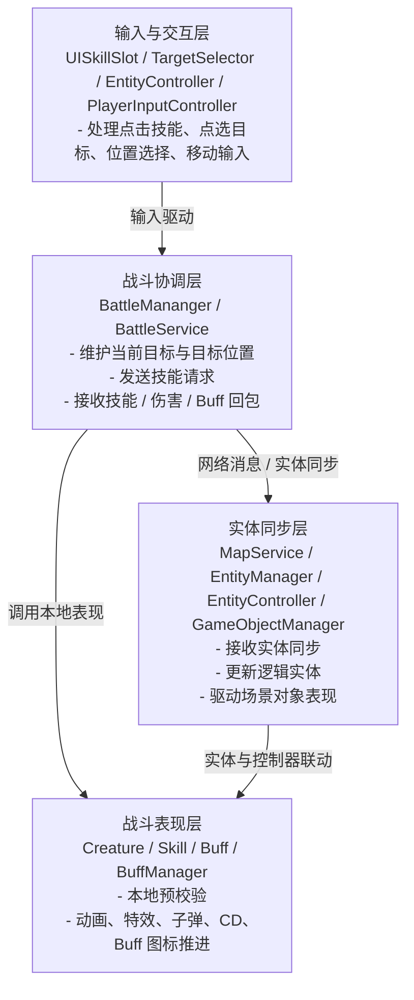
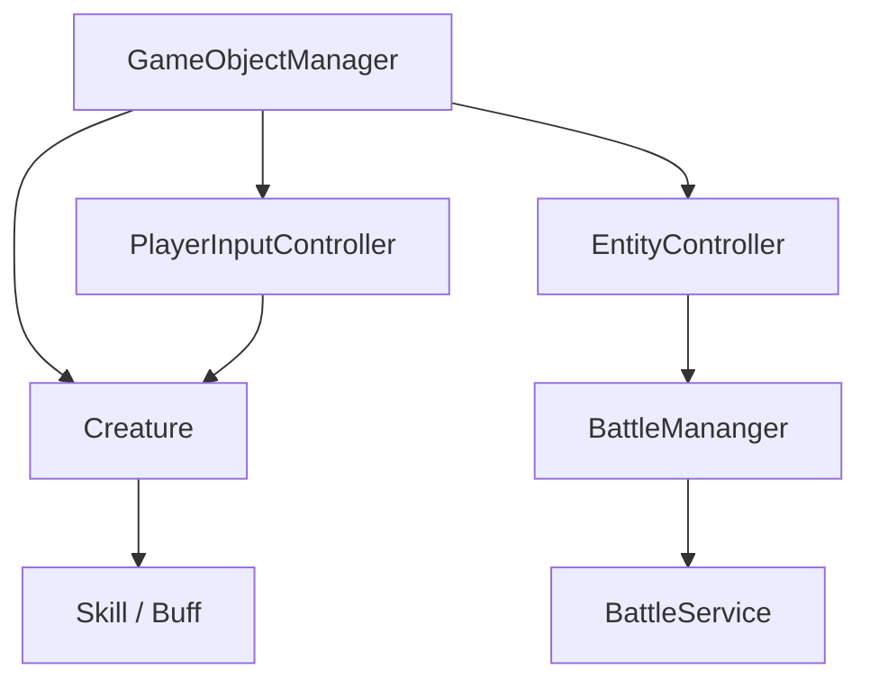

# 客户端战斗架构

## 目录
1. [核心架构设计](#1-核心架构设计)
2. [本地玩家与远端实体的更新差异](#2-本地玩家与远端实体的更新差异)
3. [客户端与服务端的职责边界](#3-客户端与服务端的职责边界)
4. [当前实现的边界与注意点](#4-当前实现的边界与注意点)
5. [代码文件结构](#5-代码文件结构)
6. [总结](#6-总结)

---

## 1. 核心架构设计

### 1.1 客户端战斗系统的四层结构

客户端战斗系统和服务端不一样，它的核心任务不是“权威结算”，而是：

- 接收玩家输入
- 进行本地预校验
- 推进动画、特效、子弹、Buff 图标等表现
- 接收服务端回包并做表现同步

从现有代码看，更适合按下面四层理解：



### 1.2 核心对象关系

客户端战斗对象的核心关系可以简化成：



可以把它理解成：

- `GameObjectManager` 负责把逻辑实体挂到场景对象上
- `EntityController` 负责实体表现
- `PlayerInputController` 只挂在当前玩家对象上
- `BattleMananger` 维护“当前战斗交互状态”
- `BattleService` 负责战斗网络收发
- `Creature / Skill / Buff` 负责本地表现推进

### 1.3 各层职责详解

#### 1.3.1 输入与交互层

**文件**:
- `Src/Client/Assets/Scripts/UI/Skill/UISkillSlot.cs`
- `Src/Client/Assets/Scripts/GameObject/TargetSelector.cs`
- `Src/Client/Assets/Scripts/GameObject/EntityController.cs`
- `Src/Client/Assets/Scripts/GameObject/PlayerInputController.cs`

**职责**:
- 响应技能按钮点击
- 点选目标单位
- 选择位置技能落点
- 处理移动、旋转、寻路输入

这一层只负责“用户怎么操作”，不负责权威结算。

#### 1.3.2 战斗协调层

**文件**:
- `Src/Client/Assets/Scripts/Managers/BattleMananger.cs`
- `Src/Client/Assets/Scripts/Services/BattleService.cs`

**职责**:
- 维护 `CreatureTarget` 和 `CreaturePosition`
- 发起技能请求
- 接收 `SkillCastResponse / SkillHitResponse / BuffResponse`
- 把回包转交给本地表现对象

这里的关键点是：

> `BattleMananger` 管“当前战斗交互状态”，`BattleService` 管“战斗协议收发”。

#### 1.3.3 战斗表现层

**文件**:
- `Src/Client/Assets/Scripts/Entities/Creature.cs`
- `Src/Client/Assets/Scripts/Battle/Skill.cs`
- `Src/Client/Assets/Scripts/Battle/SkillMananger.cs`
- `Src/Client/Assets/Scripts/Battle/Buff.cs`
- `Src/Client/Assets/Scripts/Battle/BuffManager.cs`

**职责**:
- 本地技能预校验
- 技能状态推进
- 动画与特效触发
- 伤害表现、Buff 图标、受击表现
- 本地 CD 与 Buff 生命周期更新

客户端的 `Skill` 不是用来“决定最终伤害”的，而是用来：

- 推进技能表现
- 消化服务端回包

#### 1.3.4 实体同步层

**文件**:
- `Src/Client/Assets/Scripts/Services/MapService.cs`
- `Src/Client/Assets/Scripts/Managers/EntityManager.cs`
- `Src/Client/Assets/Scripts/GameObject/GameObjectManager.cs`
- `Src/Client/Assets/Scripts/GameObject/EntityController.cs`

**职责**:
- 接收地图实体同步消息
- 更新客户端逻辑实体
- 创建或销毁场景对象
- 把逻辑实体状态映射到动画和位置表现

这一层的本质是：

> **让客户端看到“当前服务器同步过来的实体状态”。**

---

## 2. 本地玩家与远端实体的更新差异

### 2.1 最大差异：谁驱动更新

客户端最容易忽略的一点是：

- **当前玩家**：由 `PlayerInputController` 驱动
- **远端玩家 / 怪物**：由 `EntityController` 驱动

### 2.2 当前玩家更新链路

`GameObjectManager` 初始化对象时会这样设置：

```csharp
ec.isPlayer = character.IsCurrentPlayer;
pc.enabled = character.IsCurrentPlayer;
```

这意味着本地玩家对象会启用 `PlayerInputController`。

本地玩家的主循环在：

```csharp
void FixedUpdate()
{
    character.SkillMgr.OnUpdate(Time.fixedDeltaTime);
    character.BuffMgr.OnUpdate(Time.fixedDeltaTime);

    if (autoNav) { ... }
    if (InputManager.Instance?.IsInputMode == true) return;
    if (character.CastingSkill != null) { ... }

    HandleMovementInput();
    HandleRotationInput();
}
```

也就是说，本地玩家是：

- 先推进技能 / Buff
- 再处理寻路、移动和旋转输入

### 2.3 远端实体更新链路

远端实体对象不启用 `PlayerInputController`，而是靠 `EntityController.FixedUpdate()`：

```csharp
void FixedUpdate()
{
    if (!isPlayer)
    {
        entity.OnUpdate(Time.fixedDeltaTime);
        SyncTransformFromEntity();
    }
}
```

这表示远端实体的表现推进逻辑是：

```text
服务端同步 / 本地逻辑实体状态
    -> Entity.OnUpdate()
    -> EntityController.SyncTransformFromEntity()
```

### 2.4 为什么要分两套更新链

因为客户端当前玩家需要：

- 响应本地输入
- 立即播放预测表现

而远端实体不需要本地输入，只需要：

- 跟随同步数据表现
- 在本地做适度插值/推进

---

## 3. 客户端与服务端的职责边界

### 3.1 客户端负责什么

- 输入采集
- 当前目标和目标位置选择
- 技能前置校验
- 本地动画、特效、子弹、Buff 图标表现
- 收到服务端回包后的表现推进

### 3.2 服务端负责什么

- 技能是否合法
- 目标是否合法
- 命中与伤害计算
- Buff 真实状态
- 广播哪些结果给哪些玩家

### 3.3 一个最重要的原则

> **客户端负责“看起来立刻发生了什么”，服务端负责“实际上结算了什么”。**

### 3.4 这条边界在代码里的体现

客户端发请求并立即本地播放：

```csharp
BattleService.Instance.SendSkillCast(...);
skill.Owner.CastSkill(...);
```

但服务端回包后，客户端只做表现同步：

```csharp
BattleMananger.Instance.ProcessBattleMessage(message);
owner.DoBuffAction(buff);
```

客户端并没有在这里重新做权威判定。

---

## 4. 当前实现的边界与注意点

### 4.1 `BattleMananger` 更像交互状态容器

当前客户端 `BattleMananger` 主要负责：

- 当前目标
- 目标位置
- 发起施法
- 分发命中结果

它不是客户端战斗“总调度器”，更像一个：

> **战斗交互状态管理器**

### 4.2 当前玩家与远端实体的更新分散在两个控制器里

这一点很重要：

- 当前玩家主要看 `PlayerInputController`
- 远端实体主要看 `EntityController`

如果只盯着 `BattleMananger`，会误以为客户端战斗主循环不完整。

### 4.3 客户端也在本地推进 Skill / Buff

本地玩家会在 `FixedUpdate()` 中推进：

- `SkillMgr.OnUpdate`
- `BuffMgr.OnUpdate`

远端实体也会通过 `entity.OnUpdate()` 推进部分逻辑。  
所以客户端不仅是“静态显示层”，而是一个**带局部运行时推进能力的表现层**。

---

## 5. 代码文件结构

### 5.1 核心文件清单

| 文件 | 路径 | 说明 |
|------|------|------|
| **BattleMananger.cs** | `Src/Client/Assets/Scripts/Managers/BattleMananger.cs` | 战斗交互状态管理 |
| **BattleService.cs** | `Src/Client/Assets/Scripts/Services/BattleService.cs` | 战斗协议收发 |
| **Skill.cs** | `Src/Client/Assets/Scripts/Battle/Skill.cs` | 本地技能表现推进 |
| **Buff.cs** | `Src/Client/Assets/Scripts/Battle/Buff.cs` | 本地 Buff 表现与属性叠加 |
| **Creature.cs** | `Src/Client/Assets/Scripts/Entities/Creature.cs` | 客户端战斗单位 |
| **EntityController.cs** | `Src/Client/Assets/Scripts/GameObject/EntityController.cs` | 实体表现控制器 |
| **PlayerInputController.cs** | `Src/Client/Assets/Scripts/GameObject/PlayerInputController.cs` | 当前玩家输入与移动控制 |
| **MapService.cs** | `Src/Client/Assets/Scripts/Services/MapService.cs` | 地图实体同步 |
| **EntityManager.cs** | `Src/Client/Assets/Scripts/Managers/EntityManager.cs` | 客户端实体字典 |
| **GameObjectManager.cs** | `Src/Client/Assets/Scripts/GameObject/GameObjectManager.cs` | 场景对象创建与绑定 |

### 5.2 关系速查

| 场景 | 入口 | 中间层 | 最终落点 |
|------|------|--------|----------|
| 点技能 | `UISkillSlot` | `BattleMananger` | `BattleService + Skill.BeginCast` |
| 收技能回包 | `BattleService.OnSkillCast` | `Creature.CastSkill` | 远端角色表现 |
| 收伤害回包 | `BattleService.OnSkillHit` | `BattleMananger.ProcessBattleMessage` | `Creature.DoSkillHit` |
| 收 Buff 回包 | `BattleService.OnBuff` | `Creature.DoBuffAction` | `BuffManager / Buff` |
| 实体同步 | `MapService.OnMapEntitySync` | `EntityManager.OnEntitySync` | `EntityController` |

---

## 6. 总结

### 6.1 这篇最重要的四句话

1. **客户端战斗系统的核心任务是输入、预测表现和回包表现同步**
2. **`BattleMananger` 管交互状态，`BattleService` 管协议，`Skill / Buff` 管本地表现**
3. **当前玩家由 `PlayerInputController` 驱动，远端实体由 `EntityController` 驱动**
4. **客户端不是权威结算端，但也不是纯静态显示层**

### 6.2 一句话理解整个系统

> 客户端战斗系统本质上是 **“输入交互 + 本地表现推进 + 网络结果同步”** 的表现运行时。

