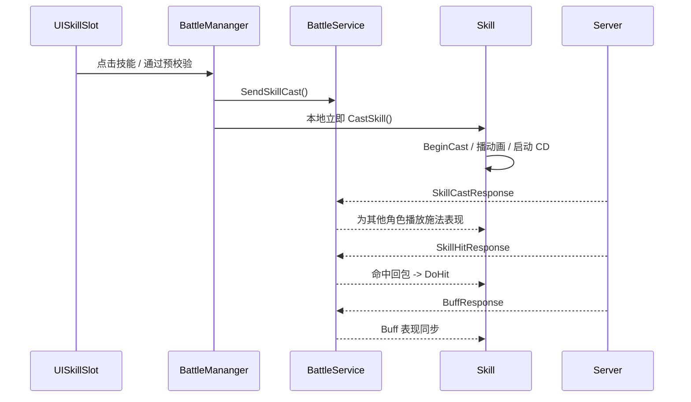

# 客户端技能表现流程

## 目录
1. [整体流程概览](#1-整体流程概览)
2. [技能发起阶段](#2-技能发起阶段)
3. [本地预测表现阶段](#3-本地预测表现阶段)
4. [服务端回包驱动阶段](#4-服务端回包驱动阶段)
5. [当前实现的关键边界](#5-当前实现的关键边界)
6. [代码文件结构](#6-代码文件结构)
7. [总结](#7-总结)

---

## 1. 整体流程概览

客户端技能表现的核心目标不是“算伤害”，而是：

- 技能点击后立刻有反馈
- 动画、特效、子弹、CD 能自然推进
- 服务端结果回来后，所有表现对象都能对齐

### 1.1 主流程时序



### 1.2 客户端技能表现的三个阶段

1. **发起阶段**：点技能、选目标、预校验、发请求  
2. **预测阶段**：本地立即播放技能动画和推进技能状态  
3. **同步阶段**：接收 `SkillCast / SkillHit / Buff` 回包并驱动最终表现  

---

## 2. 技能发起阶段

### 2.1 技能按钮入口

客户端技能入口在：

- `Src/Client/Assets/Scripts/UI/Skill/UISkillSlot.cs`

核心调用：

```csharp
public void OnPointerClick(PointerEventData eventData)
{
    if (this.skill.Define.CastTarget == TargetType.Position)
    {
        TargetSelector.ShowSelector(..., OnPositionSelected);
        return;
    }
    CasySkill();
}
```

这说明：

- 目标型技能：直接走当前目标
- 位置型技能：先弹出位置选择器

### 2.2 技能预校验

真正的预校验在 `Skill.CanCast()`：

```csharp
public SkillResult CanCast(Creature target)
{
    if (this.Owner.CastingSkill != null) return SkillResult.Casting;
    if (this.Define.CastTarget == TargetType.Target) { ... }
    if (this.Define.CastTarget == TargetType.Position && BattleMananger.Instance.CreaturePosition == null) { ... }
    if (this.Owner.Attributes.MP < this.Define.MPCost) return SkillResult.OutOfMp;
    if (this.cd > 0) return SkillResult.CoolDown;
    return SkillResult.Ok;
}
```

客户端预校验解决的是：

- 目标空不空
- 距离够不够
- MP 够不够
- CD 是否结束

### 2.3 发起施法

预校验通过后，会走到：

```csharp
BattleMananger.Instance.CastSkill(this.skill);
```

`BattleMananger.CastSkill()` 做两件事：

```csharp
BattleService.Instance.SendSkillCast(...);
skill.Owner.CastSkill(...);
```

也就是：

1. 给服务端发请求
2. 同时在本地立即播放技能

---

## 3. 本地预测表现阶段

### 3.1 `Creature.CastSkill()` 只是表现入口

客户端 `Creature.CastSkill()` 最终只是拿到技能对象并调用：

```csharp
skill.BeginCast(target, pos);
```

所以真正的技能表现核心在 `Skill.BeginCast()`。

### 3.2 `Skill.BeginCast()` 做了什么

**文件**: `Src/Client/Assets/Scripts/Battle/Skill.cs`

```csharp
public void BeginCast(Creature target, NVector3 pos)
{
    this.IsCasting = true;
    this.cd = this.Define.CD;
    this.Target = target;
    this.TargetPosition = pos;
    this.Bullets.Clear();
    this.HitMap.Clear();

    this.Owner.SetStandby(false);
    this.Owner.SetStandby(true);
    this.Owner.FaceTo(...);
    this.Owner.CastingSkill = this;
    this.Owner.PlayAnim(this.Define.SkillAnim);

    if (this.Define.CastTime > 0)
        this.Status = SkillStatus.Casting;
    else
        this.StartSkill();
}
```

这一步会完成：

- 重置技能内部状态
- 启动本地 CD
- 面向目标
- 切换角色 Standby / Casting 状态
- 播放技能动画
- 进入吟唱态或执行态

### 3.3 技能状态推进

客户端 `Skill.OnUpdate()` 会持续推进技能状态：

```csharp
public void OnUpdate(float delta)
{
    UpdateCD(delta);
    if (this.Status == SkillStatus.Casting)
        this.UpdateCateing();
    else if (this.Status == SkillStatus.Running)
        this.UpdateSkill();
}
```

这里会推进：

- CD 倒计时
- 吟唱进度
- 多段命中
- 持续技能
- 子弹飞行

### 3.4 当前玩家为什么能“先播动画”

因为在点击技能时，客户端直接本地执行了：

```csharp
skill.Owner.CastSkill(...)
```

这就是典型的：

> **客户端预测表现**

作用是：

- 手感更快
- 不必等待 RTT 后才看到起手动作

---

## 4. 服务端回包驱动阶段

### 4.1 施法回包：让其他角色也开始播技能

客户端 `BattleService` 订阅：

- `SkillCastResponse`
- `SkillHitResponse`
- `BuffResponse`

其中 `OnSkillCast()` 的关键逻辑是：

```csharp
if (caster.IsCurrentPlayer)
{
    continue;
}
caster.CastSkill(cast.skillId, target, cast.Position);
```

这说明：

- 当前玩家已经本地播过了
- 不需要再吃一次服务器的播放指令
- 远端角色则需要靠这个回包开始播放技能

### 4.2 命中回包：真正把伤害表现落到目标上

`OnSkillHit()` 最终会走到：

```csharp
BattleMananger.Instance.ProcessBattleMessage(message);
```

然后再到：

```csharp
caster?.DoSkillHit(hit);
```

最后由技能对象自己处理：

```csharp
skill.DoHit(hitId, damages);
```

如果命中时机已经到了，就立即播放：

- 扣血
- 飘字
- HitEffect

### 4.3 Buff 回包：驱动本地 Buff 表现

`BattleService.OnBuff()` 会对每个 `NBuffInfo` 做：

```csharp
owner.DoBuffAction(buff);
```

`Creature.DoBuffAction()` 根据 `BuffAction` 分发：

- `Add`
- `Remove`
- `Hit`

也就是说 Buff 回包不是直接改 UI，而是先改本地 `BuffManager / Buff`，再由事件驱动 UI。

### 4.4 Buff 图标是怎么刷新的

`Creature` 上暴露了：

- `OnBuffAdd`
- `OnBuffRemove`

`UIBuffIcons` 会订阅这些事件：

```csharp
this.owner.OnBuffAdd += OnBuffAdd;
this.owner.OnBuffRemove += OnBuffRemove;
```

所以 Buff 图标刷新链路是：

```text
BuffResponse
  -> Creature.DoBuffAction
  -> BuffManager / Buff
  -> Creature.OnBuffAdd / OnBuffRemove
  -> UIBuffIcons
```

---

## 5. 当前实现的关键边界

### 5.1 本地预测只负责“先播”，不负责“拍板”

客户端在点击技能时会先播动画，但这不表示客户端可以决定：

- 一定命中
- 一定造成多少伤害
- 一定成功上 Buff

真正结果仍然以后端回包为准。

### 5.2 `OnSkillCast` 的“跳过当前玩家”是关键防抖逻辑

如果没有：

```csharp
if (caster.IsCurrentPlayer) continue;
```

就会出现：

- 当前玩家本地先播一次
- 服务器回包后又播一次
- 动画被重置，表现抖动

### 5.3 命中表现和伤害数值不是同一时刻产生的

客户端可以先看到起手动作，但真正的：

- 扣血
- 飘字
- HitEffect

是在 `SkillHitResponse` 到达后才会落下。

### 5.4 客户端 `Skill` 是表现状态机，不是权威技能对象

客户端 `Skill` 很重要，但它的职责是：

- 管状态
- 管表现
- 管命中回放

不是服务端那种“负责最终结算”的权威技能对象。

---

## 6. 代码文件结构

### 6.1 核心文件清单

| 文件 | 路径 | 说明 |
|------|------|------|
| **UISkillSlot.cs** | `Src/Client/Assets/Scripts/UI/Skill/UISkillSlot.cs` | 技能按钮入口 |
| **BattleMananger.cs** | `Src/Client/Assets/Scripts/Managers/BattleMananger.cs` | 发起施法与转发命中 |
| **BattleService.cs** | `Src/Client/Assets/Scripts/Services/BattleService.cs` | 技能 / 命中 / Buff 回包处理 |
| **Skill.cs** | `Src/Client/Assets/Scripts/Battle/Skill.cs` | 本地技能表现状态机 |
| **Creature.cs** | `Src/Client/Assets/Scripts/Entities/Creature.cs` | 技能与 Buff 的表现入口 |
| **BuffManager.cs** | `Src/Client/Assets/Scripts/Battle/BuffManager.cs` | 本地 Buff 容器 |
| **UIBuffIcons.cs** | `Src/Client/Assets/Scripts/UI/Skill/UIBuffIcons.cs` | Buff 图标 UI |

### 6.2 关系速查

| 场景 | 入口 | 中间层 | 最终落点 |
|------|------|--------|----------|
| 点技能 | `UISkillSlot` | `BattleMananger.CastSkill` | `BattleService + Skill.BeginCast` |
| 播放远端施法 | `BattleService.OnSkillCast` | `Creature.CastSkill` | `Skill.BeginCast` |
| 播放命中效果 | `BattleService.OnSkillHit` | `BattleMananger.ProcessBattleMessage` | `Skill.DoHit` |
| Buff 图标刷新 | `BattleService.OnBuff` | `Creature.DoBuffAction` | `UIBuffIcons` |

---

## 7. 总结

### 7.1 这篇最重要的四句话

1. **客户端点击技能后会同时“发请求 + 本地先播”**
2. **客户端 `Skill` 负责表现状态机，不负责权威结算**
3. **`SkillCastResponse` 主要让其他角色开始播技能**
4. **真正的扣血、Buff 变化要等 `SkillHitResponse / BuffResponse`**

### 7.2 一句话理解整个流程

> 客户端技能表现流程本质上是 **“本地预测起手 + 服务端回包校正表现”**。

