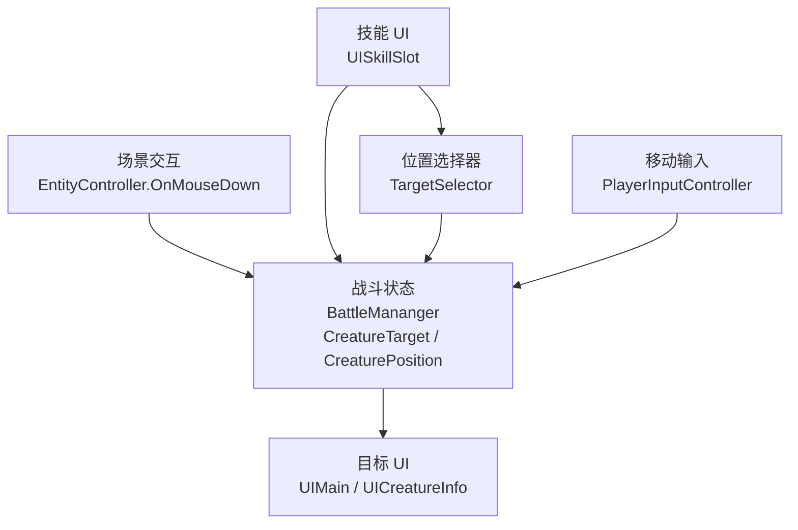

# 客户端目标选择与输入系统

## 目录
1. [核心结构概览](#1-核心结构概览)
2. [目标选择链路](#2-目标选择链路)
3. [位置技能选择链路](#3-位置技能选择链路)
4. [移动与施法输入的关系](#4-移动与施法输入的关系)
5. [当前实现的边界与注意点](#5-当前实现的边界与注意点)
6. [代码文件结构](#6-代码文件结构)
7. [总结](#7-总结)

---

## 1. 核心结构概览

客户端战斗输入不是单点触发，而是由几块一起配合：



可以把它简化成一句话：

> **目标选择和位置选择的状态都集中放在 `BattleMananger`，UI 和场景交互只是输入源。**

---

## 2. 目标选择链路

### 2.1 点击场景实体进行选中

场景里点一个怪物或玩家，入口在 `EntityController.OnMouseDown()`：

```csharp
private void OnMouseDown()
{
    Creature target = entity as Creature;
    if (target?.IsCurrentPlayer == true) return;

    BattleMananger.Instance.CreatureTarget = entity as Creature;
}
```

这里的规则很简单：

- 点击自己：忽略
- 点击其他 `Creature`：设为当前目标

### 2.2 `BattleMananger` 持有当前目标

`BattleMananger` 里有：

```csharp
private Creature currentTarget;
public Creature CreatureTarget
{
    get => currentTarget;
    set => SetTarget(value);
}
```

设置目标时会触发事件：

```csharp
OnTargetChanged?.Invoke(target);
currentTarget = target;
```

### 2.3 目标 UI 如何刷新

`UIMain` 在启动时订阅：

```csharp
BattleMananger.Instance.OnTargetChanged += OnTargetChanaged;
```

收到目标变化后更新：

- `TargetUI`
- 目标面板显示 / 隐藏

所以目标选择完整链路是：

```text
点击实体
  -> EntityController.OnMouseDown
  -> BattleMananger.SetTarget
  -> OnTargetChanged
  -> UIMain.OnTargetChanaged
  -> 目标面板刷新
```

---

## 3. 位置技能选择链路

### 3.1 技能按钮先判断目标类型

位置技能不是直接施放，而是先打开目标选择器：

```csharp
public void OnPointerClick(PointerEventData eventData)
{
    if (this.skill.Define.CastTarget == TargetType.Position)
    {
        TargetSelector.ShowSelector(this.skill.Define.CastRange, this.skill.Define.AOERange, OnPositionSelected);
        return;
    }
    CasySkill();
}
```

### 3.2 `TargetSelector` 的职责

`TargetSelector` 会：

- 在地面显示投影圈
- 跟随鼠标移动
- 限制选择距离不超过技能范围
- 左键确认位置
- 右键取消位置选择

关键逻辑：

```csharp
if (dist.magnitude > this.range)
{
    hitPoint = center + dist.normalized * this.range;
}
```

这说明位置技能在客户端先做了一层：

> **施法范围裁剪**

### 3.3 位置选择后如何进入战斗流程

选完位置后，`UISkillSlot.OnPositionSelected()` 会执行：

```csharp
BattleMananger.Instance.CreaturePosition = GameObjectTool.WorldToLogicN(pos);
this.CasySkill();
```

然后再正常走：

- `Skill.CanCast()`
- `BattleMananger.CastSkill()`
- `BattleService.SendSkillCast()`

### 3.4 位置目标数据放在哪里

位置目标不挂在技能按钮上，而是挂在 `BattleMananger`：

```csharp
private NVector3 currentPosition;
public NVector3 CreaturePosition
{
    get => currentPosition;
    set => SetPosition(value);
}
```

所以客户端这套设计里：

- 当前目标单位：`CreatureTarget`
- 当前技能落点：`CreaturePosition`

都统一放在 `BattleMananger` 中。

---

## 4. 移动与施法输入的关系

### 4.1 本地玩家输入由 `PlayerInputController` 负责

**文件**: `Src/Client/Assets/Scripts/GameObject/PlayerInputController.cs`

本地玩家主循环中有三个关键分支：

```csharp
if (autoNav) { ... }
if (InputManager.Instance?.IsInputMode == true) return;
if (character.CastingSkill != null) { ... }
```

这表示：

- 寻路中时，优先走寻路逻辑
- 输入框激活时，屏蔽移动输入
- 施法中时，进入施法状态处理

### 4.2 施法期间会阻止正常移动

施法时会进入：

```csharp
private void HandleCastingState()
{
    rb.velocity = Vector3.zero;
    character.Stop();
    ...
}
```

这说明客户端当前实现里：

> **施法状态会强制停止常规移动输入。**

### 4.3 移动输入最终会同步给服务器

移动和转向的变化不会只停留在本地，还会通过：

```csharp
MapService.Instance.SendMapEntitySync(entityEvent, character?.EntityData, param);
```

发送出去。

所以移动系统和战斗系统虽然分代码模块，但在运行时其实是联动的：

- 位置会影响技能目标距离判定
- 朝向会影响技能表现方向
- 施法状态会反过来阻断移动输入

---

## 5. 当前实现的边界与注意点

### 5.1 `BattleMananger` 同时持有目标和位置，职责有点“偏胖”

现在客户端把：

- 当前目标
- 当前位置目标
- 施法发起

都放进了 `BattleMananger`。  
这对小项目是够用的，但如果后续加入更多战斗交互（锁定、切换目标、自动选敌、智能施法），它可能会越来越胖。

### 5.2 目标选择主要靠场景点击，而不是独立 TargetSystem

当前目标选择入口主要在：

- `EntityController.OnMouseDown()`

这意味着目标系统是“依附在实体控制器上的”，而不是一个独立的 TargetManager。

### 5.3 位置技能选择器是客户端辅助工具，不是权威判定器

`TargetSelector` 会帮用户限制范围、选择落点，但这不等于服务端一定认可。  
服务端仍然要负责：

- 最终合法性校验
- 最终是否命中

---

## 6. 代码文件结构

### 6.1 核心文件清单

| 文件 | 路径 | 说明 |
|------|------|------|
| **BattleMananger.cs** | `Src/Client/Assets/Scripts/Managers/BattleMananger.cs` | 持有当前目标与位置目标 |
| **EntityController.cs** | `Src/Client/Assets/Scripts/GameObject/EntityController.cs` | 点击实体选中目标 |
| **UISkillSlot.cs** | `Src/Client/Assets/Scripts/UI/Skill/UISkillSlot.cs` | 技能按钮与施法入口 |
| **TargetSelector.cs** | `Src/Client/Assets/Scripts/GameObject/TargetSelector.cs` | 位置技能选择器 |
| **PlayerInputController.cs** | `Src/Client/Assets/Scripts/GameObject/PlayerInputController.cs` | 当前玩家移动与输入 |
| **UIMain.cs** | `Src/Client/Assets/Scripts/UI/UIMain/UIMain.cs` | 目标 UI 更新 |

### 6.2 关系速查

| 场景 | 入口 | 中间层 | 最终落点 |
|------|------|--------|----------|
| 点选目标 | `EntityController.OnMouseDown` | `BattleMananger.SetTarget` | `UIMain.TargetUI` |
| 点位置技能 | `UISkillSlot.OnPointerClick` | `TargetSelector.ShowSelector` | `BattleMananger.CreaturePosition` |
| 施法发起 | `UISkillSlot.CasySkill` | `BattleMananger.CastSkill` | `BattleService.SendSkillCast` |
| 移动同步 | `PlayerInputController` | `MapService.SendMapEntitySync` | 服务端地图同步 |

---

## 7. 总结

### 7.1 这篇最重要的三句话

1. **目标单位和位置落点都统一由 `BattleMananger` 持有**
2. **目标型技能靠点选实体，位置型技能靠 `TargetSelector`**
3. **移动输入、目标选择和施法输入在运行时是相互制约的**

### 7.2 一句话理解整个系统

> 客户端目标选择与输入系统本质上是 **“场景交互 + UI 输入 + Battle 状态管理”** 的组合系统。

