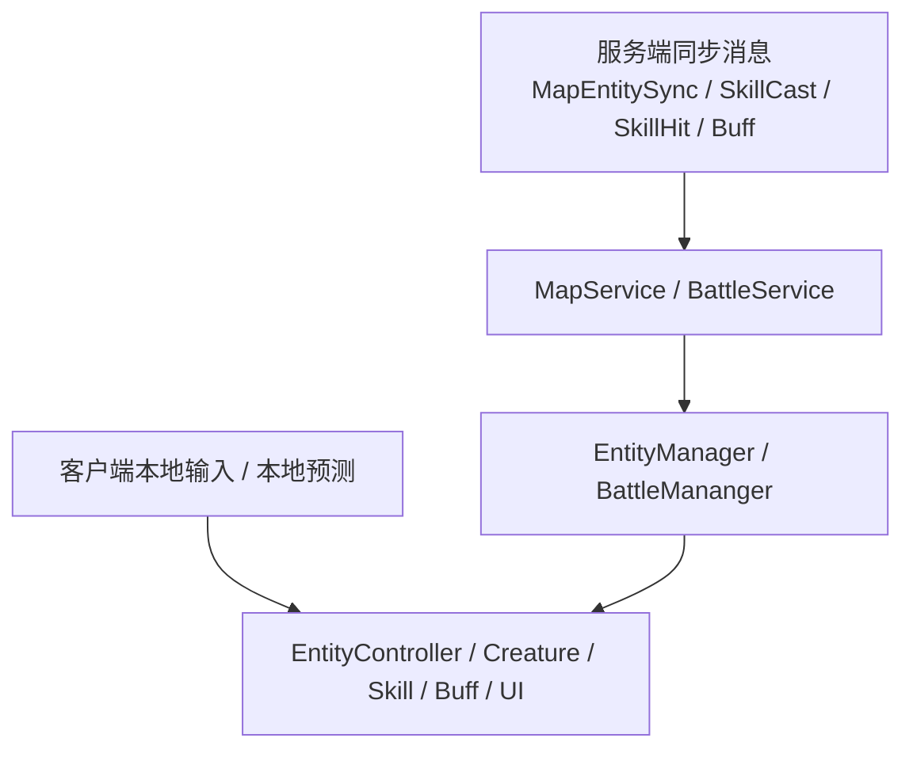

# 客户端表现同步与校正

## 目录
1. [整体机制概览](#1-整体机制概览)
2. [实体同步链路](#2-实体同步链路)
3. [技能与 Buff 的表现同步](#3-技能与-buff-的表现同步)
4. [当前玩家与远端对象的校正差异](#4-当前玩家与远端对象的校正差异)
5. [当前实现的边界与注意点](#5-当前实现的边界与注意点)
6. [代码文件结构](#6-代码文件结构)
7. [总结](#7-总结)

---

## 1. 整体机制概览

客户端“同步与校正”的核心问题是：

- 本地已经先播了表现
- 服务端结果稍后才回来
- 怎么让玩家看到的结果既流畅，又不至于完全脱离服务端

从现有代码看，客户端同步可以拆成两条线：

1. **实体同步线**：位置、朝向、动作事件同步  
2. **战斗结果线**：施法、命中、Buff 回包同步  

### 1.1 总体图



一句话理解：

> **客户端先本地推进表现，随后再用服务端同步消息把表现拉回权威轨道。**

---

## 2. 实体同步链路

### 2.1 客户端主动上报本地实体状态

当前玩家的移动、转向、动作事件会通过：

```csharp
MapService.Instance.SendMapEntitySync(entityEvent, character?.EntityData, param);
```

发给服务端。

这一步上报的是：

- 位置
- 朝向
- 速度
- 动作事件（Idle / Move / Jump / Ride 等）

### 2.2 服务端回包后如何落到客户端实体

客户端收到 `MapEntitySyncResponse` 后：

```csharp
EntityManager.Instance.OnEntitySync(entity);
```

`EntityManager.OnEntitySync()` 会：

1. 更新逻辑实体 `EntityData`
2. 通知对应的 `IEntityNotify`

```csharp
entity.EntityData = data.Entity;
notifiers[entity.EntityId].OnEntityChanged(entity);
notifiers[entity.EntityId].OnEntityEvent(data.Event, data.Param);
```

### 2.3 场景对象如何响应同步

场景里的 `EntityController` 实现了 `IEntityNotify`，因此能收到：

- `OnEntityChanged`
- `OnEntityEvent`

`OnEntityEvent()` 会根据事件切换动画或行为：

- `Idle`
- `MoveFwd`
- `MoveBack`
- `Jump`
- `Ride`

所以实体同步链路是：

```text
MapService.OnMapEntitySync
  -> EntityManager.OnEntitySync
  -> EntityController.OnEntityChanged / OnEntityEvent
  -> 动画 / 位置 / 坐骑表现更新
```

### 2.4 为什么说这是一种“软校正”

当前客户端没有看到很重的“瞬移回拉”逻辑，更多是：

- 更新逻辑实体数据
- 让 `EntityController` 跟随逻辑实体同步表现

所以它更像是一种：

> **持续同步 + 温和贴齐**

而不是强硬的瞬时纠偏系统。

---

## 3. 技能与 Buff 的表现同步

### 3.1 施法同步

`BattleService.OnSkillCast()` 会遍历 `SkillCastResponse.castInfoes`：

```csharp
Creature caster = EntityManager.Instance.GetEntity(cast.casterId) as Creature;
if (caster.IsCurrentPlayer)
{
    continue;
}
caster.CastSkill(cast.skillId, target, cast.Position);
```

这一段的作用是：

- 当前玩家：跳过，避免重播动画
- 其他角色：根据服务器广播开始播放施法动作

所以 `SkillCastResponse` 的核心作用不是“告诉当前玩家你施法成功了”，而是：

> **让周围其他对象与当前玩家看到一致的施法表现。**

### 3.2 命中同步

`BattleService.OnSkillHit()` 最终走到：

```csharp
BattleMananger.Instance.ProcessBattleMessage(message);
```

再到：

```csharp
caster?.DoSkillHit(hit);
```

这一步真正完成：

- 伤害表现
- 飘字
- HitEffect
- 多段伤害回放

### 3.3 Buff 同步

`BattleService.OnBuff()` 会对每个 `NBuffInfo` 做：

```csharp
owner.DoBuffAction(buff);
```

本地再根据 `BuffAction` 分派：

- `Add`
- `Remove`
- `Hit`

然后推进：

- 本地 Buff 属性叠加 / 回滚
- Buff 特效
- Buff 图标 UI

---

## 4. 当前玩家与远端对象的校正差异

### 4.1 当前玩家：先本地播，再跳过自己的施法回包

当前玩家点技能时会立即：

- 播动画
- 启动技能状态
- 启动 CD

因此收到 `SkillCastResponse` 时，会刻意跳过自己：

```csharp
if (caster.IsCurrentPlayer) continue;
```

这是一种典型的：

> **预测后防重放**

### 4.2 远端对象：主要依赖回包和同步来播表现

远端玩家和怪物不会走本地点击输入，因此：

- 技能表现主要靠 `SkillCastResponse`
- 命中表现主要靠 `SkillHitResponse`
- Buff 表现主要靠 `BuffResponse`
- 动作与位移主要靠 `MapEntitySyncResponse`

### 4.3 本地玩家移动也不是完全自由的

虽然本地玩家靠输入控制移动，但仍然持续向服务端发：

- 位置
- 朝向
- 状态事件

这说明本地玩家不是脱离同步系统单独运行，而是：

> **一边本地控制，一边持续和服务端保持状态对齐。**

---

## 5. 当前实现的边界与注意点

### 5.1 当前同步系统更偏表现一致，不是高强度反作弊纠偏

从客户端代码能直接看到的是：

- 预测表现
- 回包修正表现
- 实体状态同步

但没有看到特别重的：

- 客户端硬回滚
- 轨迹重演
- 输入重放

所以它更适合描述为：

> **表现同步系统**

而不是严格意义上的高级网络校正框架。

### 5.2 技能起手与命中是分离同步的

客户端会先看到“起手动作”，再等“命中回包”。  
这意味着如果网络抖动，玩家可能看到：

- 技能已经起手
- 但命中效果稍后才到

这正是预测表现和权威结算分离的副作用。

### 5.3 本地 Buff 生命周期和服务端 Buff 生命周期不是一回事

客户端 `Buff` 也会本地按时间推进移除：

```csharp
if (this.time > this.Define.Duration)
{
    this.OnRemove();
}
```

但真正权威的 Buff 状态仍然来自服务端。  
因此客户端这里更偏：

- 表现连续性
- UI 连续性

而不是最终裁决。

---

## 6. 代码文件结构

### 6.1 核心文件清单

| 文件 | 路径 | 说明 |
|------|------|------|
| **MapService.cs** | `Src/Client/Assets/Scripts/Services/MapService.cs` | 地图实体同步 |
| **EntityManager.cs** | `Src/Client/Assets/Scripts/Managers/EntityManager.cs` | 逻辑实体同步入口 |
| **EntityController.cs** | `Src/Client/Assets/Scripts/GameObject/EntityController.cs` | 动画与场景表现同步 |
| **BattleService.cs** | `Src/Client/Assets/Scripts/Services/BattleService.cs` | 技能 / 命中 / Buff 同步 |
| **BattleMananger.cs** | `Src/Client/Assets/Scripts/Managers/BattleMananger.cs` | 命中回包转发 |
| **Creature.cs** | `Src/Client/Assets/Scripts/Entities/Creature.cs` | 命中与 Buff 表现入口 |
| **Buff.cs** | `Src/Client/Assets/Scripts/Battle/Buff.cs` | 本地 Buff 表现推进 |

### 6.2 关系速查

| 场景 | 入口 | 中间层 | 最终落点 |
|------|------|--------|----------|
| 实体同步 | `MapService.OnMapEntitySync` | `EntityManager.OnEntitySync` | `EntityController` |
| 施法同步 | `BattleService.OnSkillCast` | `Creature.CastSkill` | 远端技能起手表现 |
| 命中同步 | `BattleService.OnSkillHit` | `BattleMananger.ProcessBattleMessage` | `Skill.DoHit` |
| Buff 同步 | `BattleService.OnBuff` | `Creature.DoBuffAction` | `BuffManager / UI` |

---

## 7. 总结

### 7.1 这篇最重要的四句话

1. **客户端同步分两条线：实体同步线和战斗结果线**
2. **当前玩家先本地预测，远端对象主要依赖回包播放**
3. **`OnSkillCast` 跳过当前玩家是防止表现重播的关键逻辑**
4. **客户端同步系统的重点是表现一致，而不是完全替代服务端权威**

### 7.2 一句话理解整个系统

> 客户端表现同步与校正，本质上是 **“本地先播 + 服务端结果回包 + 实体状态持续贴齐”** 的表现一致性机制。

