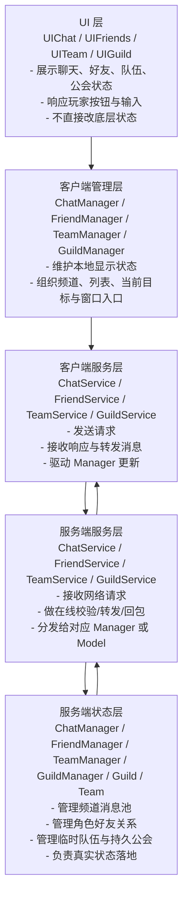

# 核心架构系统分析

## 目录
1. [社交系统整体分层](#1-社交系统整体分层)
2. [四类社交子系统的定位](#2-四类社交子系统的定位)
3. [客户端运行链路](#3-客户端运行链路)
4. [服务端支撑链路](#4-服务端支撑链路)
5. [当前实现的边界与风险](#5-当前实现的边界与风险)
6. [总结](#6-总结)

---

## 1. 社交系统整体分层

### 1.1 五层结构概览

从当前项目代码看，社交系统更适合按“交互链路”理解，而不是只按普通的 UI/业务/数据三层理解，因为它大量涉及玩家之间的请求转发和状态回推。

### 1.2 社交系统为什么更强调“交互链路”

和背包、任务不同，社交系统里大量行为都不是单机式处理，而是：

- A 发请求
- 服务端定位 B
- B 做确认
- 服务端修改状态
- 双方收到结果或更新

所以社交系统更适合围绕以下三种链路来理解：

1. **请求-响应**：例如创建公会、退出队伍。
2. **请求-转发-再响应**：例如加好友、组队邀请、公会申请。
3. **状态同步/消息分发**：例如聊天消息、队伍信息、公会信息。

---

## 2. 四类社交子系统的定位

### 2.1 聊天系统

聊天系统解决的是“消息怎么分频道、怎么分发、怎么显示”的问题。

它的核心不是关系状态，而是：

- 频道隔离
- 消息收集
- 显示过滤
- 即时转发或增量获取

### 2.2 好友系统

好友系统解决的是“两个玩家之间关系如何建立和维护”的问题。

它的核心特点是：

- 双向确认
- 双边数据同时修改
- 在线状态需要联动刷新

### 2.3 组队系统

组队系统更像是一个临时会话状态。

特点是：

- 生命周期短
- 成员变更频繁
- 本地显示依赖整包队伍信息覆盖

### 2.4 公会系统

公会系统更像是持久化组织管理。

特点是：

- 有长期存在的组织对象
- 有成员、申请、职位、公告等复杂状态
- 有明显的权限控制需求

---

## 3. 客户端运行链路

### 3.1 Manager 的职责边界

客户端每个社交 Manager 的职责都比较清晰：

- `ChatManager`：维护不同标签页下的消息列表、当前发送频道和私聊目标。
- `FriendManager`：维护好友列表。
- `TeamManager`：维护 `User.Instance.TeamInfo` 的显示入口。
- `GuildManager`：维护当前公会信息、我的公会身份和窗口入口。

它们的共同特点是：

> **Manager 更偏“本地状态组织器”，而不是直接做网络通信。**

### 3.2 Service 的职责边界

客户端 Service 则负责：

- 发包
- 收包
- 在需要时弹确认框
- 把结果同步回 Manager 或 UI

例如：

- `FriendService` 会在收到 `FriendAddRequest` 后直接弹框，由玩家选择接受/拒绝。
- `TeamService` 在收到 `TeamInviteRequest` 后做同样的确认。
- `GuildService` 在收到 `GuildJoinRequest` 后也会弹审批框。

所以社交系统里 Service 除了通信，还承担一部分“交互桥接”的职责。

### 3.3 UI 的位置

社交 UI 整体都比较薄：

- `UIChat` 从 `ChatManager` 读取当前消息文本。
- `UIFriends` 从 `FriendManager` 读取好友列表，并发起私聊/组队/删除好友。
- `UITeam` 从 `User.Instance.TeamInfo` 读取队伍成员。
- `UIGuild` 从 `GuildManager.guildInfo` 读取成员和权限状态。

这意味着 UI 主要负责：

1. 展示 Manager 已整理好的状态。
2. 把用户操作转成 Service 调用。

---

## 4. 服务端支撑链路

### 4.1 服务端并不是所有模块都用同一种 Manager 模式

从代码看，服务端社交系统至少有三种状态承载方式：

#### 4.1.1 全局单例型

- `ChatManager`
- `TeamManager`
- `GuildManager`

这些对象负责全局共享状态，例如：

- 所有世界消息
- 所有队伍
- 所有公会

#### 4.1.2 角色组件型

- `Character.FriendManager`

这类状态只属于某个玩家本身，生命周期跟角色一致。

#### 4.1.3 领域对象型

- `Guild`
- `Team`

它们负责承载一组成员的真实组织状态，并能在后处理阶段把数据写回网络响应。

### 4.2 服务端常见处理模式

#### 4.2.1 直接转发

例如私聊、好友请求、组队邀请、公会申请，服务端会先通过 `SessionManager` 找目标在线会话，再决定是否转发。

#### 4.2.2 存储后再分发/拉取

聊天中的世界、本地、队伍、公会消息不会像私聊一样逐条直推给所有人，而是先进入 `ChatManager` 的消息池。

#### 4.2.3 状态更新后整体回推

例如队伍与公会，真实成员状态发生变化后，客户端一般通过新的 `TeamInfo` 或 `GuildInfo` 看到结果。

---

## 5. 当前实现的边界与风险

### 5.1 社交请求高度依赖“对方在线”

无论好友、私聊、组队还是公会申请，当前实现大多先走在线 Session 查找。也就是说：

- 离线消息支持较弱
- 离线好友审批/离线邀请承接也较弱

### 5.2 客户端 Manager 偏轻，很多刷新依赖 Service 回调

例如好友和公会更多是通过 Service 回包或事件驱动刷新，而不是所有逻辑都沉淀在 Manager 中。这种方式简单，但状态入口容易分散。

### 5.3 组队和公会更接近“全量覆盖”思路

当前客户端 `TeamManager.UpdateTeamInfo()` 直接覆盖 `User.Instance.TeamInfo`，公会系统也更多依赖最新 `GuildInfo` 初始化。这种方式简单，但不够增量化。

### 5.4 权限与异常校验还有继续细化空间

例如公会管理命令、聊天发言资格、重复邀请、脏状态并发等，目前从代码上看仍有进一步加强空间。

---

## 6. 总结

社交系统整体可以压缩成一句话：

> **客户端 Manager 组织本地社交状态，Service 负责请求与消息桥接，服务端再按“在线转发、全局组织管理、玩家组件状态”三种方式维护真实社交数据。**

如果要在面试或复盘里快速描述，可以直接说：

- 聊天系统解决消息分流与显示
- 好友系统解决双向关系建立
- 组队系统解决临时多人会话
- 公会系统解决持久化组织与权限管理
- 所有真实结果最终以后端处理结果为准
